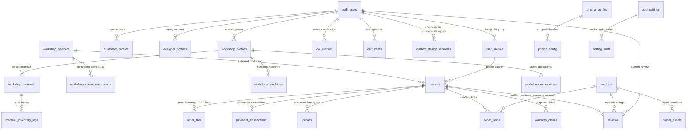

# VCUBE Database Schema Specification

> **Platform**: VCUBE 3.0 Digital Manufacturing & CAD Marketplace  
> **Database**: Supabase PostgreSQL 15+  
> **Schema Revision**: 20260901 Baseline + 20261010 Hardening + Phase 3 Studio Extensions  
> **Total Entities**: 31 Relational Tables + 1 Compatibility View (`pricing_config`) + 49 Indexes (48 + 1 partial unique; 2 GIN) + 7 Core Functions + 5 Triggers (25 instances) + 2 Storage Buckets

---

## 1. Architecture Overview

The VCUBE database is structured to support a three-sided digital fabrication marketplace:
1. **Customers (Buyers)**: Browse 3D models, order on-demand 3D printing, upload CAD models for automated geometric quoting, commission custom designs, and track 8-stage manufacturing progress in real time.
2. **Designers (Creators)**: Upload industrial CAD files, set physical and digital licenses, manage intellectual property (IP), and receive recurring royalty payouts.
3. **Workshops (Fabrication Partners)**: Manage localized printer fleets, material stocks, manufacturing queues, quality control (QC), and receive partner payouts.
4. **Platform Administrators & QC Engineers**: Maintain global material pricing matrices, commission agreements, identity verifications (KYC), system audits, and warranty dispute resolutions.

All client operations interact through Supabase's PostgREST layer using the client-safe publishable key (`sb_publishable_...`). Data integrity, multi-tenant isolation, and role boundaries are enforced strictly at the database level using PostgreSQL Row Level Security (RLS) and defensive triggers.

---

## 2. Entity-Relationship Diagram (ERD)



### Key Relationships & Foreign Key Invariants
- **Authentication Anchor**: All user identities anchor to Supabase `auth.users(id)`. Primary profile data lives in `public.user_profiles` with `ON DELETE CASCADE`.
- **Role-Specific Sub-Profiles**: `customer_profiles`, `designer_profiles`, and `workshop_profiles` extend `auth.users(id)` with specific business capabilities.
- **Production Assignment**: An order links to `workshop_partners(id)` via `orders.assigned_workshop_id`. Work order items (`order_items`) isolate workshop payout calculation from designer royalties and platform commissions.
- **Digital Asset Security**: `digital_assets` maps product IDs to private storage paths under `cad-files` (`digital/<auth.uid>/...`), protected by strict RLS so unauthenticated parties never discover raw asset paths.

---

## 3. Custom Types, Domain Enums & Value Constraints

PostgreSQL `CHECK` constraints are utilized across tables to maintain deterministic validation, portability across migration environments, and full type safety.

| Domain Concept | Storage Type | Allowed Values / Pattern | Table & Column |
|---|---|---|---|
| **App Role** | `text` | `'customer'`, `'designer'`, `'workshop'`, `'lab'`, `'admin'` | `user_profiles.role` |
| **Order Status** | `text` | `'pending_payment'`, `'processing'`, `'printing'`, `'post_processing'`, `'packaging'`, `'shipping'`, `'completed'`, `'cancelled'` | `orders.status` |
| **Order Stage Index** | `integer` | `0` to `7` (maps exactly to the 8 manufacturing stages) | `orders.status_stage_index` |
| **Payment Status** | `text` | `'unpaid'`, `'pending'`, `'paid'`, `'failed'`, `'refunded'` | `orders.payment_status` |
| **Payout Status** | `text` | `'unpaid'`, `'paid'`, `'partial'` | `orders.workshop_payout_status`, `orders.designer_payout_status` |
| **KYC Verification** | `text` | `'verified'`, `'pending'`, `'pending_review'`, `'rejected'`, `'unverified'` | `user_profiles.kyc_status`, `kyc_records.status` |
| **Account Status** | `text` | `'active'`, `'suspended'` | `user_profiles.account_status` |
| **Workshop Status** | `text` | `'Pending'`, `'Verified'`, `'Suspended'` | `workshop_profiles.verified_status` |
| **Seller Type** | `text` | `'platform'`, `'designer'` | `order_items.seller_type` |
| **Fulfillment Type**| `text` | `'print'`, `'digital'` | `order_items.fulfillment` |
| **Review Target** | `text` | `'designer'`, `'workshop'`, `'product'` | `reviews.target_type` |
| **Review Rating** | `integer` | `1`, `2`, `3`, `4`, `5` | `reviews.rating` |
| **Review Status** | `text` | `'published'`, `'hidden'`, `'pending'` | `reviews.status` |
| **Inventory Action** | `text` | `'Import'`, `'Export'`, `'Adjustment'` | `material_inventory_logs.action` |
| **Setting Audit Store**| `text` | `'site_content'`, `'app_settings'`, `'pricing_global_settings'`, `'pricing_configs'`, `'order_payouts'` | `setting_audit.store` |
| **Custom Request Status** | `text` | `'pending'`, `'quoted'`, `'in_progress'`, `'completed'`, `'declined'` | `custom_design_requests.status` |
| **Warranty Claim Status** | `text` | `'submitted'`, `'reviewing'`, `'approved'`, `'rejected'`, `'resolved'` | `warranty_claims.status` |
| **Vietnam Tax ID** | `text` | `^[0-9]{10}(-[0-9]{3})?$` (10 or 13 digits) | `app_settings.tax_code` |
| **Bank Account** | `text` | `^[0-9]+$` (Digits only) | `app_settings.bank_account` |
| **Contact Email** | `text` | Standard RFC 5322 email regex format | `app_settings.contact_email` |

---

## 4. Comprehensive Table Specifications

### 4.1 Group 1: Core Catalog & Digital Assets

#### `public.products`
Central commercial catalog storing both physical 3D printable products and downloadable CAD licenses.
- **Primary Key**: `id` (`text`)
- **Indexes**:
  - `idx_products_status_created` ON `(status, created_at desc)`
  - `idx_products_category` ON `(category)`
  - `idx_products_tags` USING GIN `(tags)`

| Column | Data Type | Nullable | Default | Description & Foreign Keys |
|---|---|---|---|---|
| `id` | `text` | NO | None | Unique slug / identifier (e.g. `'gearbox-v2'`) |
| `sku` | `text` | YES | `NULL` | Internal inventory SKU code |
| `name` | `text` | NO | None | Product title |
| `category` | `text` | NO | `'mechanical'` | Category (`'mechanical'`, `'iot'`, `'robotics'`, etc.) |
| `designer` | `text` | YES | `NULL` | Public display name of the original designer |
| `price_physical` | `numeric` | NO | `0` | Base selling price for 3D printed physical item (VND) |
| `price_digital` | `numeric` | NO | `0` | Selling price for digital CAD license (VND) |
| `images` | `jsonb` | NO | `'[]'::jsonb` | Array of image URLs for gallery preview |
| `thumbnail_url` | `text` | YES | `''` | Primary thumbnail URL |
| `cad_file_url` | `text` | YES | `''` | Preview mesh URL (GLTF/GLB) or signed URL link |
| `cad_format` | `text` | YES | `NULL` | Source CAD format (`'STEP'`, `'STL'`, `'3MF'`, etc.) |
| `file_size_bytes` | `bigint` | YES | `0` | Size of raw CAD model file |
| `description` | `text` | YES | `''` | Long-form markdown product overview |
| `features` | `jsonb` | NO | `'[]'::jsonb` | Feature highlights list |
| `specs` | `jsonb` | NO | `'{}'::jsonb` | Dimensions, volume, recommended infill, technology |
| `supported_materials` | `jsonb` | NO | `'[]'::jsonb` | Allowed material types (`['PLA Tough', 'PETG', 'Nylon-CF']`) |
| `colors` | `jsonb` | NO | `'[]'::jsonb` | Available color variants `[{ name, hex, available }]` |
| `tags` | `jsonb` | NO | `'[]'::jsonb` | Search tags |
| `badge` | `text` | YES | `''` | UI badge (`'Hot'`, `'New'`, `'Industrial'`) |
| `rating` | `numeric` | YES | `NULL` | Cached average rating (updated by `trg_sync_product_review_stats`) |
| `reviews_count` | `int` | NO | `0` | Total published reviews count (auto-updated by trigger) |
| `prints_count` | `int` | NO | `0` | Number of times physically manufactured |
| `print_time` | `text` | YES | `NULL` | Estimated machine print duration |
| `is_customizable`| `boolean` | NO | `false` | Indicates whether dimensional parametric tuning is enabled |
| `status` | `text` | NO | `'published'` | Visibility status (`'draft'`, `'published'`, `'archived'`) |
| `production_readiness` | `text` | NO | `'ready_to_print'` | Readiness level (`'ready_to_print'`, `'cad_review_needed'`) |
| `seller_type` | `text` | NO | `'designer'` | Seller of record (`'platform'`, `'designer'`); `products_seller_type_chk` |
| `license_type` | `text` | YES | `NULL` | License type. `NULL` = designer has not declared (never guessed/defaulted) |
| `created_at` | `timestamptz` | NO | `now()` | Record creation timestamp |
| `updated_at` | `timestamptz` | NO | `now()` | Last modified timestamp (auto-updated by trigger) |

---

#### `public.materials`
Platform-wide master material reference catalog and base cost parameters.
- **Primary Key**: `id` (`text`)
- **Indexes**: `idx_materials_in_stock` ON `(in_stock)`

| Column | Data Type | Nullable | Default | Description |
|---|---|---|---|---|
| `id` | `text` | NO | None | Unique slug (e.g. `'pla-tough'`, `'nylon-cf'`) |
| `name` | `text` | NO | None | Material display name |
| `brand` | `text` | YES | `NULL` | Manufacturer / filament brand |
| `type` | `text` | NO | `'FDM'` | Technology category (`'FDM'`, `'SLA'`, `'SLS'`) |
| `density` | `numeric` | YES | `NULL` | Material density in $\text{g/cm}^3$ |
| `strength` | `text` | YES | `NULL` | Tensile strength descriptor |
| `heat_resistance`| `text` | YES | `NULL` | Maximum deflection temperature (e.g. `'80°C'`) |
| `flexibility` | `text` | YES | `NULL` | Shore hardness or flexural modulus descriptor |
| `cost_per_kg` | `numeric` | YES | `NULL` | Raw procurement cost per kg (VND) |
| `price_per_gram`| `numeric` | YES | `NULL` | Standard end-user pricing per gram (VND) |
| `unit_price_multiplier` | `numeric` | YES | `NULL` | Multiplier factor used in `pricingEngine.ts` to derive unit rate |
| `spool_weight_grams` | `numeric` | YES | `NULL` | Standard spool net weight (g) |
| `extruder_temp_min` | `int` | YES | `NULL` | Minimum extrusion temperature (°C) |
| `extruder_temp_max` | `int` | YES | `NULL` | Maximum extrusion temperature (°C) |
| `bed_temp` | `int` | YES | `NULL` | Heated bed temperature (°C) |
| `colors` | `jsonb` | NO | `'[]'::jsonb` | Available color palettes |
| `desc` | `text` | YES | `''` | Material engineering summary (quoted identifier) |
| `recommended_for` | `text` | YES | `''` | Use-case recommendations |
| `in_stock` | `boolean` | NO | `true` | Platform availability toggle |
| `stock_rolls_count` | `int` | YES | `NULL` | Central warehouse inventory rolls |
| `failure_extra_percent` | `numeric` | YES | `NULL` | Extra failure-reserve % for hard-to-print materials. `NULL` = no extra (never guessed) |
| `created_at` | `timestamptz` | NO | `now()` | Creation timestamp |
| `updated_at` | `timestamptz` | NO | `now()` | Auto-updated timestamp |

---

#### `public.printer_fleet`
Master manufacturing fleet catalog modeling 3D printer hardware specs and operational costs.
- **Primary Key**: `id` (`text`)
- **Indexes**: `idx_printers_status` ON `(status)`

| Column | Data Type | Nullable | Default | Description |
|---|---|---|---|---|
| `id` | `text` | NO | None | Unique printer slug (e.g. `'bambu-x1c-01'`) |
| `name` | `text` | NO | None | Machine model name |
| `brand` | `text` | YES | `NULL` | Manufacturer (`'Bambu Lab'`, `'Creality'`, `'Prusa'`) |
| `model` | `text` | YES | `''` | Model variant |
| `technology` | `text` | NO | `'FDM'` | Printing method (`'FDM'`, `'SLA'`, `'SLS'`) |
| `bed_dimensions` | `jsonb` | YES | `NULL` | Print envelope `{ x: 256, y: 256, z: 256 }` |
| `build_volume` | `jsonb` | YES | `NULL` | Legacy dimension representation |
| `nozzle_diameter` | `numeric` | YES | `NULL` | Installed nozzle diameter (mm) |
| `power_kw` | `numeric` | YES | `NULL` | Rated power consumption (kW) |
| `acquisition_cost` | `numeric` | YES | `NULL` | Capital asset cost (VND) |
| `expected_lifetime_hours` | `numeric` | YES | `NULL` | Depreciation lifetime rating |
| `consumables_hourly_rate` | `numeric` | YES | `NULL` | Hourly wear and tear cost (VND) |
| `hourly_rate` | `numeric` | YES | `NULL` | Retail machine operating price / hr (VND) |
| `hourly_cost` | `numeric` | YES | `NULL` | Internal machine operating cost / hr (VND) |
| `max_print_speed_mms` | `numeric` | YES | `NULL` | Max print head traversal speed (mm/s) |
| `heated_bed_max_temp` | `numeric` | YES | `NULL` | Max bed temperature (°C) |
| `has_enclosure` | `boolean` | YES | `false` | Active/passive enclosed chamber |
| `has_ams` | `boolean` | YES | `false` | Multi-material automated system flag |
| `status` | `text` | NO | `'Idle'` | Machine status (`'Idle'`, `'Printing'`, `'Maintenance'`) |
| `created_at` | `timestamptz` | NO | `now()` | Creation timestamp |
| `updated_at` | `timestamptz` | NO | `now()` | Auto-updated timestamp |

---

#### `public.accessories`
Hardware components, fasteners, bearings, heat inserts, and electronics sold or bundled with prints.
- **Primary Key**: `id` (`text`)

| Column | Data Type | Nullable | Default | Description |
|---|---|---|---|---|
| `id` | `text` | NO | None | Unique item slug |
| `sku` | `text` | YES | `NULL` | SKU identifier |
| `name` | `text` | NO | None | Name in Vietnamese |
| `name_en` | `text` | YES | `''` | Name in English |
| `type` | `text` | NO | `'hardware'` | Item category (`'hardware'`, `'electronic'`, `'fastener'`) |
| `category` | `text` | YES | `'hardware'` | Group classification |
| `unit` | `text` | YES | `'cái'` | Unit of measure (`'cái'`, `'bộ'`, `'hộp'`) |
| `cost_price` | `numeric` | NO | `0` | Wholesale purchase price (VND) |
| `price` | `numeric` | NO | `0` | Retail sale price (VND) |
| `stock_quantity`| `int` | NO | `0` | Physical stock count |
| `low_stock_threshold` | `int` | YES | `NULL` | Replenishment warning trigger level |
| `warehouse_location` | `text` | YES | `''` | Bin / shelf tracking code |
| `supplier` | `text` | YES | `NULL` | Vendor name |
| `description` | `text` | YES | `''` | Detailed specifications |
| `image_url` | `text` | YES | `''` | Thumbnail image |
| `compatible_with` | `jsonb` | NO | `'[]'::jsonb` | Product IDs compatible with this accessory |
| `in_stock` | `boolean` | NO | `true` | In-stock boolean flag |
| `created_at` | `timestamptz` | NO | `now()` | Creation timestamp |
| `updated_at` | `timestamptz` | NO | `now()` | Auto-updated timestamp |

---

#### `public.digital_assets`
Designer-managed digital files, download tokens, and CAD file metadata.
- **Primary Key**: `id` (`uuid`, default `gen_random_uuid()`)
- **Foreign Keys**: `designer_id -> auth.users(id) ON DELETE CASCADE`
- **Indexes**:
  - `idx_digital_assets_product` ON `(product_id)`
  - `idx_digital_assets_designer` ON `(designer_id)`
- **Constraints**: `check (download_limit is null or download_limit >= 0)`

| Column | Data Type | Nullable | Default | Description |
|---|---|---|---|---|
| `id` | `uuid` | NO | `gen_random_uuid()` | Unique digital asset record ID |
| `product_id` | `text` | NO | None | Associated catalog product ID |
| `designer_id` | `uuid` | NO | None | Designer user ID (`auth.users.id`) |
| `storage_path`| `text` | NO | None | Path in `cad-files` bucket (`digital/<uid>/...`) |
| `file_format` | `text` | NO | `''` | CAD format (`'STEP'`, `'STL'`, `'3MF'`, etc.) |
| `file_size_bytes` | `bigint` | YES | `NULL` | Exact byte count |
| `checksum` | `text` | YES | `NULL` | SHA-256 integrity hash |
| `license_type` | `text` | YES | `NULL` | Digital license (`'standard'`, `'commercial'`, `'extended'`) |
| `download_limit` | `int` | YES | `NULL` | Max allowed downloads per purchase |
| `watermark_required` | `boolean` | NO | `true` | Whether digital mesh watermarking is applied |
| `created_at` | `timestamptz` | NO | `now()` | Creation timestamp |
| `updated_at` | `timestamptz` | NO | `now()` | Auto-updated timestamp |

---

#### `public.cart_items`
Persistent shopping cart storing both physical manufacturing orders and digital licenses.
- **Primary Key**: `id` (`uuid`, default `gen_random_uuid()`)
- **Foreign Keys**: `user_id -> auth.users(id) ON DELETE CASCADE`
- **Unique Constraint**: `cart_items_user_product_key` ON `(user_id, product_id)`
- **Indexes**: `idx_cart_items_user` ON `(user_id, updated_at desc)`
- **Constraints**: `check (quantity >= 1)`

| Column | Data Type | Nullable | Default | Description |
|---|---|---|---|---|
| `id` | `uuid` | NO | `gen_random_uuid()` | Unique cart item ID |
| `user_id` | `uuid` | NO | None | Customer account ID |
| `product_id` | `text` | NO | None | Product ID being purchased |
| `quantity` | `int` | NO | `1` | Item quantity ($\ge 1$) |
| `unit_price_snapshot` | `numeric` | YES | `NULL` | Locked unit price at time of cart addition |
| `added_at` | `timestamptz` | NO | `now()` | Addition timestamp |
| `updated_at` | `timestamptz` | NO | `now()` | Auto-updated timestamp |

---

### 4.2 Group 2: Order Management, Payments & Quotes

#### `public.orders`
Master order record supporting guest checkout, 8-stage manufacturing tracking, multi-partner routing, and financial breakdown.
- **Primary Key**: `id` (`text`)
- **Foreign Keys**: `user_id -> auth.users(id) ON DELETE SET NULL`
- **Unique Constraint**: `orders_order_number_key` ON `(order_number)`
- **Indexes**:
  - `idx_orders_user_id` ON `(user_id)`
  - `idx_orders_customer_email` ON `(customer_email)`
  - `idx_orders_secure_token` ON `(secure_access_token)`
  - `idx_orders_order_number` ON `(order_number)`
  - `idx_orders_status` ON `(status)`
  - `idx_orders_assigned_workshop` ON `(assigned_workshop_id)`
  - `idx_orders_created` ON `(created_at desc)`

| Column | Data Type | Nullable | Default | Description |
|---|---|---|---|---|
| `id` | `text` | NO | None | Unique order ID (`'ord_...'`) |
| `order_number` | `text` | YES | `NULL` | Human-readable order code (e.g. `'VC-2026-0901'`) |
| `user_id` | `uuid` | YES | `NULL` | Buyer user ID (`NULL` for guest checkout) |
| `date` | `timestamptz` | NO | `now()` | Order timestamp |
| `estimated_delivery` | `text` | YES | `''` | Promised delivery window |
| `status` | `text` | NO | `'pending_payment'` | Lifecycle status (8 states) |
| `status_stage_index` | `int` | NO | `0` | Stage index (0: Unpaid, 1: Prep, 2: Slice, 3: Print, 4: QC, 5: Post, 6: Ship, 7: Done) |
| `layer_progress` | `int` | NO | `0` | Live slice layer printing percentage (0-100) |
| `customer_email` | `text` | NO | `''` | Customer email for communication & invoice delivery |
| `customer_name` | `text` | YES | `''` | Recipient full name |
| `customer_phone` | `text` | YES | `''` | Recipient phone number |
| `customer_type` | `text` | NO | `'guest'` | Classification (`'guest'`, `'registered'`, `'b2b'`) |
| `total_amount` | `numeric` | NO | `0` | Final payable total in VND (items + shipping + VAT) |
| `shipping_fee` | `numeric` | NO | `0` | Applied shipping cost |
| `payment_method`| `text` | NO | `'cod'` | Selected gateway (`'vietqr'`, `'vnpay'`, `'cod'`) |
| `payment_status`| `text` | NO | `'unpaid'` | Payment state (`'unpaid'`, `'paid'`, `'refunded'`) |
| `secure_access_token` | `text` | NO | None | 32-char cryptographically secure token for guest order tracking |
| `quote_token` | `jsonb` | YES | `NULL` | Snapshot of original instant quote parameters |
| `items` | `jsonb` | NO | `'[]'::jsonb` | Denormalized array of purchased line items |
| `shipping_address` | `jsonb` | NO | `'{}'::jsonb` | Structured address `{ street, ward, district, city }` |
| `carrier` | `jsonb` | NO | `'{}'::jsonb` | Shipping provider info `{ name, tracking_code }` |
| `payment` | `jsonb` | NO | `'{}'::jsonb` | Gateway transaction reference & timestamps |
| `assigned_workshop_id` | `text` | YES | `NULL` | Workshop partner code assigned to manufacture this order |
| `assigned_printer_id` | `text` | YES | `NULL` | Designated hardware machine ID |
| `notes` | `text` | YES | `''` | Customer delivery notes |
| `subtotal_amount` | `numeric` | YES | `NULL` | Items subtotal before tax/shipping — base for platform fee |
| `vat_percent_snapshot` | `numeric` | YES | `NULL` | VAT rate captured at order time (%) |
| `vat_amount` | `numeric` | YES | `NULL` | VAT amount in VND |
| `platform_fee_percent_snapshot` | `numeric` | YES | `NULL` | Platform % fee captured at order time |
| `platform_fixed_fee_snapshot` | `numeric` | YES | `NULL` | Platform fixed fee (VND) captured at order time |
| `platform_fee_amount` | `numeric` | YES | `NULL` | Total platform fee in VND |
| `workshop_payout_amount` | `numeric` | YES | `NULL` | Payout due to the assigned workshop (VND) |
| `designer_payout_amount` | `numeric` | YES | `NULL` | Royalty payout due to the designer (VND) |
| `workshop_payout_status` | `text` | NO | `'unpaid'` | Workshop payout state (`'unpaid'`, `'paid'`, …) |
| `designer_payout_status` | `text` | NO | `'unpaid'` | Designer payout state (`'unpaid'`, `'paid'`, …) |
| `workshop_payout_paid_at` | `timestamptz` | YES | `NULL` | Timestamp the workshop payout was settled |
| `workshop_payout_paid_by` | `uuid` | YES | `NULL` | Admin user who settled the workshop payout |
| `designer_payout_paid_at` | `timestamptz` | YES | `NULL` | Timestamp the designer payout was settled |
| `designer_payout_paid_by` | `uuid` | YES | `NULL` | Admin user who settled the designer payout |
| `created_at` | `timestamptz` | NO | `now()` | Creation timestamp |
| `updated_at` | `timestamptz` | NO | `now()` | Auto-updated timestamp (privileged columns guarded by trigger) |

---

#### `public.order_items`
Itemized line-item accounting table recording revenue splits among platform, designer, and fabrication workshop.
- **Primary Key**: `id` (`uuid`, default `gen_random_uuid()`)
- **Foreign Keys**: `order_id -> public.orders(id) ON DELETE CASCADE`
- **Indexes**:
  - `idx_order_items_order` ON `(order_id)`
  - `idx_order_items_workshop` ON `(workshop_id)`
  - `idx_order_items_designer` ON `(designer_id)`
  - `idx_order_items_product` ON `(product_id)`
- **Constraints**:
  - `check (seller_type in ('platform','designer'))`
  - `check (fulfillment in ('print','digital'))`
  - `check (quantity >= 1)`

| Column | Data Type | Nullable | Default | Description |
|---|---|---|---|---|
| `id` | `uuid` | NO | `gen_random_uuid()` | Line item record ID |
| `order_id` | `text` | NO | None | Parent order ID |
| `product_id` | `text` | NO | None | Product ID |
| `seller_type` | `text` | NO | None | Entity providing CAD IP (`'platform'`, `'designer'`) |
| `fulfillment` | `text` | NO | None | Manufacturing mode (`'print'`, `'digital'`) |
| `quantity` | `int` | NO | `1` | Item count |
| `unit_price` | `numeric` | NO | `0` | Sale price per unit (VND) |
| `line_total` | `numeric` | NO | `0` | Total price for line (unit_price * quantity) |
| `workshop_id` | `text` | YES | `NULL` | Assigned workshop partner ID |
| `designer_id` | `uuid` | YES | `NULL` | Designer recipient ID |
| `workshop_commission_percent_snapshot` | `numeric` | YES | `NULL` | Snapshot of workshop rate at order time |
| `royalty_percent_snapshot` | `numeric` | YES | `NULL` | Snapshot of designer royalty % |
| `workshop_payout_amount` | `numeric` | YES | `NULL` | Calculated payout due to workshop (VND) |
| `designer_payout_amount` | `numeric` | YES | `NULL` | Calculated royalty payout due to designer (VND) |
| `platform_fee_amount` | `numeric` | YES | `NULL` | Platform gross margin retainer (VND) |
| `created_at` | `timestamptz` | NO | `now()` | Creation timestamp |

---

#### `public.order_files`
Secure mapping of 3D CAD files uploaded or purchased as part of an order.
- **Primary Key**: `id` (`uuid`, default `gen_random_uuid()`)
- **Foreign Keys**: `order_id -> public.orders(id) ON DELETE CASCADE`
- **Indexes**:
  - `idx_order_files_order` ON `(order_id)`
  - `idx_order_files_path` ON `(storage_path)`

| Column | Data Type | Nullable | Default | Description |
|---|---|---|---|---|
| `id` | `uuid` | NO | `gen_random_uuid()` | File record ID |
| `order_id` | `text` | NO | None | Parent order ID |
| `product_id` | `text` | YES | `NULL` | Related catalog product ID (if catalog item) |
| `storage_path`| `text` | NO | None | Path in `cad-files` private storage bucket |
| `license` | `text` | NO | `'personal'` | Granted usage rights (`'personal'`, `'commercial'`) |
| `created_at` | `timestamptz` | NO | `now()` | Upload timestamp |

---

#### `public.quotes`
Instant 3D printing geometric analysis quotes generated via the 3D pricing engine.
- **Primary Key**: `id` (`text`)
- **Foreign Keys**:
  - `user_id -> auth.users(id) ON DELETE SET NULL`
  - `order_id -> public.orders(id) ON DELETE SET NULL`
- **Indexes**:
  - `idx_quotes_user` ON `(user_id, created_at desc)`
  - `idx_quotes_expires` ON `(expires_at)`

| Column | Data Type | Nullable | Default | Description |
|---|---|---|---|---|
| `id` | `text` | NO | None | Unique quote code (`'quo_...'`) |
| `user_id` | `uuid` | YES | `NULL` | User requesting quote (`NULL` for guest) |
| `order_id` | `text` | YES | `NULL` | Linked order ID once converted to purchase |
| `file_name` | `text` | YES | `''` | Original CAD filename uploaded |
| `material_id` | `text` | YES | `NULL` | Selected material ID |
| `printer_id` | `text` | YES | `NULL` | Recommended printer model |
| `volume_cm3` | `numeric` | YES | `NULL` | Computed geometric volume ($\text{cm}^3$) |
| `infill_percent` | `numeric` | YES | `NULL` | Configured infill density (e.g. `20`) |
| `layer_height_mm` | `numeric` | YES | `NULL` | Sliced layer height (e.g. `0.2`) |
| `quantity` | `int` | NO | `1` | Batch quantity |
| `unit_price` | `numeric` | YES | `0` | Calculated unit manufacturing price |
| `total_price` | `numeric` | YES | `0` | Final quote amount (VND) |
| `currency` | `text` | NO | `'VND'` | ISO currency code |
| `payload` | `jsonb` | NO | `'{}'::jsonb` | Full B.O.M breakdown (material, machine, labor, overhead) |
| `expires_at` | `timestamptz` | YES | `NULL` | Expiration timestamp (typically 7-14 days) |
| `created_at` | `timestamptz` | NO | `now()` | Calculation timestamp |

---

#### `public.payment_transactions`
Audit trail of payment gateway webhooks, VietQR confirmations, and refunds.
- **Primary Key**: `id` (`text`)
- **Foreign Keys**: `order_id -> public.orders(id) ON DELETE CASCADE`
- **Unique Constraint**: `payment_transactions_transaction_id_key` ON `(transaction_id)`
- **Indexes**:
  - `idx_payment_tx_id` ON `(transaction_id)`
  - `idx_payment_order` ON `(order_id)`

| Column | Data Type | Nullable | Default | Description |
|---|---|---|---|---|
| `id` | `text` | NO | None | Internal transaction ledger ID |
| `order_id` | `text` | YES | `NULL` | Target order ID |
| `transaction_id` | `text` | NO | None | Gateway transaction reference (VietQR tid / VNPay txn) |
| `amount` | `numeric` | NO | `0` | Transacted amount in VND |
| `payment_gateway`| `text` | NO | `'vietqr'` | Gateway provider (`'vietqr'`, `'vnpay'`) |
| `payload` | `jsonb` | NO | `'{}'::jsonb` | Verbatim webhook response payload |
| `status` | `text` | NO | `'pending'` | State (`'pending'`, `'success'`, `'failed'`) |
| `created_at` | `timestamptz` | NO | `now()` | Gateway notification timestamp |

---

#### `public.warranty_claims`
Customer RMA and quality disputes concerning dimensional tolerance or surface defects.
- **Primary Key**: `id` (`uuid`, default `gen_random_uuid()`)
- **Foreign Keys**:
  - `order_id -> public.orders(id) ON DELETE CASCADE`
  - `user_id -> auth.users(id) ON DELETE SET NULL`
- **Indexes**:
  - `idx_warranty_order` ON `(order_id)`
  - `idx_warranty_status_time` ON `(status, created_at desc)`
  - `idx_warranty_user` ON `(user_id)`
- **Constraints**: `check (status in ('submitted','reviewing','approved','rejected','resolved'))`

| Column | Data Type | Nullable | Default | Description |
|---|---|---|---|---|
| `id` | `uuid` | NO | `gen_random_uuid()` | Claim ticket UUID |
| `order_id` | `text` | NO | None | Associated order ID |
| `user_id` | `uuid` | YES | `NULL` | Claimant user ID |
| `reason` | `text` | NO | None | Defect category (`'tolerance_out_of_spec'`, `'warping'`, etc.) |
| `description` | `text` | NO | `''` | Customer statement |
| `photo_paths` | `text[]` | NO | `'{}'` | Storage paths of defect photographic evidence |
| `status` | `text` | NO | `'submitted'` | Processing state |
| `resolution` | `text` | NO | `''` | Admin/lab findings and resolution |
| `handled_by` | `uuid` | YES | `NULL` | Staff account reviewing ticket |
| `created_at` | `timestamptz` | NO | `now()` | Ticket submission timestamp |
| `updated_at` | `timestamptz` | NO | `now()` | Auto-updated timestamp |

---

### 4.3 Group 3: User Profiles & Identity Management

#### `public.user_profiles`
Primary identity and authorization record binding an authenticated user to their system role.
- **Primary Key**: `id` (`uuid`)
- **Foreign Keys**: `id -> auth.users(id) ON DELETE CASCADE`
- **Indexes**: `idx_profiles_role` ON `(role)`
- **Constraints**:
  - `check (role in ('customer','designer','workshop','lab','admin'))`
  - `check (kyc_status in ('verified','pending','pending_review','rejected','unverified'))`
  - `check (account_status in ('active','suspended'))`

| Column | Data Type | Nullable | Default | Description |
|---|---|---|---|---|
| `id` | `uuid` | NO | None | Matches `auth.users.id` |
| `email` | `text` | NO | `''` | User login email |
| `display_name` | `text` | YES | `''` | Public screen name |
| `phone` | `text` | YES | `''` | Contact telephone number |
| `role` | `text` | NO | `'customer'` | DB-enforced system role (governs all RLS permissions) |
| `tier` | `text` | NO | `'Standard'` | Customer tier (`'Standard'`, `'Pro'`, `'Enterprise'`) |
| `company` | `text` | YES | `''` | Business or organization name |
| `avatar_url` | `text` | YES | `''` | Profile avatar image link |
| `kyc_status` | `text` | NO | `'unverified'` | Identity verification status |
| `kyc_details` | `jsonb` | NO | `'{}'::jsonb` | KYC verification metadata |
| `account_status`| `text` | NO | `'active'` | Account state (`'active'`, `'suspended'`) |
| `total_orders` | `int` | NO | `0` | Cumulative successful orders count |
| `total_spent` | `numeric` | NO | `0` | Cumulative spend volume in VND |
| `notes` | `text` | YES | `''` | Internal admin notes |
| `created_at` | `timestamptz` | NO | `now()` | Account creation timestamp |
| `updated_at` | `timestamptz` | NO | `now()` | Auto-updated timestamp (privileged columns guarded by trigger) |

---

#### `public.customer_profiles`
Extended enterprise customer details (NDA status, B2B tax credentials).
- **Primary Key**: `id` (`uuid`, default `gen_random_uuid()`)
- **Foreign Keys**: `user_id -> auth.users(id) ON DELETE CASCADE`
- **Indexes**: `idx_customer_user` ON `(user_id)`

| Column | Data Type | Nullable | Default | Description |
|---|---|---|---|---|
| `id` | `uuid` | NO | `gen_random_uuid()` | Profile record ID |
| `user_id` | `uuid` | YES | `NULL` | Owner user ID |
| `display_name` | `text` | YES | `''` | Preferred customer name |
| `company` | `text` | YES | `''` | Legal company name |
| `tax_id` | `text` | YES | `''` | Corporate tax identification number |
| `business_address` | `text` | YES | `''` | Registered billing address |
| `phone` | `text` | YES | `''` | Official phone number |
| `nda_signed` | `boolean` | NO | `false` | Bilateral IP non-disclosure agreement acceptance |
| `nda_signed_at` | `timestamptz` | YES | `NULL` | Timestamp of digital NDA signature |
| `created_at` | `timestamptz` | NO | `now()` | Creation timestamp |
| `updated_at` | `timestamptz` | NO | `now()` | Auto-updated timestamp |

---

#### `public.designer_profiles`
Public portfolio, biography, royalty terms, and sales metrics for CAD designers.
- **Primary Key**: `id` (`uuid`, default `gen_random_uuid()`)
- **Foreign Keys**: `user_id -> auth.users(id) ON DELETE CASCADE`
- **Indexes**: `idx_designer_user` ON `(user_id)`

| Column | Data Type | Nullable | Default | Description |
|---|---|---|---|---|
| `id` | `uuid` | NO | `gen_random_uuid()` | Profile record ID |
| `user_id` | `uuid` | YES | `NULL` | Designer user ID |
| `display_name` | `text` | YES | `''` | Designer brand name |
| `bio` | `text` | YES | `''` | Professional summary |
| `portfolio_url` | `text` | YES | `''` | External portfolio link |
| `avatar_url` | `text` | YES | `''` | Creator avatar |
| `bank_name` | `text` | YES | `''` | Payout bank name |
| `bank_account` | `text` | YES | `''` | Payout bank account number |
| `tax_id` | `text` | YES | `''` | Personal income tax code |
| `royalty_percent` | `numeric` | NO | `10` | Default royalty share (%) on digital sales |
| `verified_status` | `text` | NO | `'Pending'` | Verification badge status |
| `rating` | `numeric` | YES | `NULL` | Designer average rating |
| `total_sales` | `numeric` | NO | `0` | Cumulative digital CAD sales in VND |
| `created_at` | `timestamptz` | NO | `now()` | Creation timestamp |
| `updated_at` | `timestamptz` | NO | `now()` | Auto-updated timestamp |

---

#### `public.workshop_profiles`
Operational profile of a manufacturing workshop, linking owner to production facilities.
- **Primary Key**: `id` (`uuid`, default `gen_random_uuid()`)
- **Foreign Keys**: `user_id -> auth.users(id) ON DELETE SET NULL`
- **Indexes**:
  - `idx_ws_profiles_user` ON `(user_id)`
  - `idx_ws_profiles_verified` ON `(verified_status)`
- **Constraints**: `check (verified_status in ('Pending','Verified','Suspended'))`

| Column | Data Type | Nullable | Default | Description |
|---|---|---|---|---|
| `id` | `uuid` | NO | `gen_random_uuid()` | Workshop profile record ID |
| `user_id` | `uuid` | YES | `NULL` | Workshop owner account ID |
| `partner_id` | `text` | YES | `NULL` | Bound partner code (links to `workshop_partners.id`; guarded by trigger) |
| `workshop_name` | `text` | NO | None | Trading name of the facility |
| `address` | `text` | NO | `''` | Workshop physical factory address |
| `region` | `text` | NO | `'Bắc'` | Geographical hub (`'Bắc'`, `'Trung'`, `'Nam'`) |
| `total_machines` | `int` | NO | `0` | Total registered machine fleet |
| `active_machines_now` | `int` | NO | `0` | Online machines ready for jobs |
| `electricity_rate_override` | `numeric` | YES | `NULL` | Custom industrial electric rate (VND/kWh) |
| `labor_rate_override` | `numeric` | YES | `NULL` | Custom technician rate (VND/hr) |
| `verified_status` | `text` | NO | `'Pending'` | Admin vetting state (cannot be altered by owner) |
| `contact_phone` | `text` | YES | `''` | Emergency workshop phone |
| `contact_email` | `text` | YES | `''` | Workshop operational email |
| `created_at` | `timestamptz` | NO | `now()` | Creation timestamp |
| `updated_at` | `timestamptz` | NO | `now()` | Auto-updated timestamp |

---

#### `public.kyc_records`
Identity verification records (CCCD, Business Registration, Tax verification).
- **Primary Key**: `id` (`text`)
- **Foreign Keys**: `user_id -> auth.users(id) ON DELETE CASCADE`
- **Indexes**:
  - `idx_kyc_user` ON `(user_id)`
  - `uq_kyc_records_one_pending` (Partial Unique) ON `(user_id) WHERE status = 'pending'`

| Column | Data Type | Nullable | Default | Description |
|---|---|---|---|---|
| `id` | `text` | NO | None | Unique KYC submission ID |
| `user_id` | `uuid` | YES | `NULL` | Submitting user ID |
| `doc_type` | `text` | NO | `'cccd'` | Document type (`'cccd'`, `'business_license'`) |
| `doc_number` | `text` | YES | `''` | Government document number |
| `company` | `text` | YES | `''` | Company legal name |
| `tax_id` | `text` | YES | `''` | Registered tax code |
| `bank_name` | `text` | YES | `''` | Verified banking partner |
| `bank_account` | `text` | YES | `''` | Verified account number |
| `status` | `text` | NO | `'pending'` | Review status (`'pending'`, `'approved'`, `'rejected'`) |
| `payload` | `jsonb` | NO | `'{}'::jsonb` | Encrypted document hashes & photo references |
| `reviewed_by` | `text` | YES | `NULL` | Admin reviewer username/ID |
| `reviewed_at` | `timestamptz` | YES | `NULL` | Approval/rejection timestamp |
| `notes` | `text` | YES | `''` | Compliance notes |
| `created_at` | `timestamptz` | NO | `now()` | Submission timestamp |

---

### 4.4 Group 4: Workshop Fleet & Inventory Operations

#### `public.workshop_partners`
Public network of vetted manufacturing hubs displayed on the platform.
- **Primary Key**: `id` (`text`)

| Column | Data Type | Nullable | Default | Description |
|---|---|---|---|---|
| `id` | `text` | NO | None | Unique partner slug (e.g. `'hanoi-hub-01'`) |
| `name` | `text` | NO | None | Facility name |
| `code` | `text` | YES | `NULL` | Short routing code |
| `region` | `text` | NO | `'hanoi'` | Hub region (`'hanoi'`, `'danang'`, `'hcm'`) |
| `address` | `text` | YES | `''` | Factory location |
| `contact_person` | `text` | YES | `''` | Factory manager name |
| `phone` | `text` | YES | `''` | Contact phone |
| `email` | `text` | YES | `''` | Contact email |
| `capacity_status` | `text` | NO | `'available'` | Workload status (`'available'`, `'busy'`, `'full'`) |
| `status` | `text` | NO | `'active'` | Operational status (`'active'`, `'inactive'`) |
| `rating` | `numeric` | YES | `NULL` | SLA quality score (1.0 - 5.0) |
| `sla_on_time_rate`| `numeric` | YES | `NULL` | Percentage of jobs dispatched on time |
| `active_jobs_count` | `int` | NO | `0` | Real-time queue count |
| `available_printers_count` | `int` | NO | `0` | Idle machines ready |
| `completed_jobs_count` | `int` | NO | `0` | Lifetime completed order items |
| `current_queue_length` | `numeric` | YES | `0` | Estimated queue time (hours) |
| `supported_technologies` | `jsonb` | NO | `'[]'::jsonb` | Technologies (`['FDM', 'SLA', 'SLS']`) |
| `max_build_volume` | `jsonb` | YES | `NULL` | Largest available envelope `{ x, y, z }` |
| `in_stock_materials` | `jsonb` | NO | `'[]'::jsonb` | List of cached available filament types |
| `created_at` | `timestamptz` | NO | `now()` | Registration timestamp |
| `updated_at` | `timestamptz` | NO | `now()` | Auto-updated timestamp |

---

#### `public.workshop_commission_terms`
Private negotiated commission rates and settlement terms between platform and workshop partners.
- **Primary Key**: `partner_id` (`text`)
- **Foreign Keys**: `partner_id -> public.workshop_partners(id) ON DELETE CASCADE`
- **Constraints**: `check (commission_percent is null or (commission_percent >= 0 and commission_percent <= 30))`

| Column | Data Type | Nullable | Default | Description |
|---|---|---|---|---|
| `partner_id` | `text` | NO | None | Matches `workshop_partners.id` |
| `commission_percent` | `numeric` | YES | `NULL` | Negotiated platform commission percentage (0-30%) |
| `note` | `text` | YES | `NULL` | Contractual terms and SLA conditions |
| `updated_by` | `text` | YES | `NULL` | Admin account modifying agreement |
| `updated_at` | `timestamptz` | NO | `now()` | Last revision timestamp |

---

#### `public.workshop_machines`
Specific printer units operating within an individual workshop profile.
- **Primary Key**: `id` (`uuid`, default `gen_random_uuid()`)
- **Foreign Keys**: `workshop_id -> public.workshop_profiles(id) ON DELETE CASCADE`
- **Indexes**: `idx_ws_machines_workshop` ON `(workshop_id)`

| Column | Data Type | Nullable | Default | Description |
|---|---|---|---|---|
| `id` | `uuid` | NO | `gen_random_uuid()` | Machine asset UUID |
| `workshop_id` | `uuid` | NO | None | Owning workshop profile ID |
| `name` | `text` | NO | None | Machine unit label |
| `brand` | `text` | YES | `''` | Manufacturer brand |
| `model` | `text` | YES | `''` | Model |
| `technology` | `text` | NO | `'FDM'` | Printing technology |
| `bed_dimensions` | `jsonb` | YES | `NULL` | Usable volume `{ x, y, z }` |
| `status` | `text` | NO | `'active'` | Machine availability (`'active'`, `'offline'`) |
| `hourly_rate` | `numeric` | YES | `NULL` | Workshop-specific billing rate (VND/hr) |
| `created_at` | `timestamptz` | NO | `now()` | Creation timestamp |
| `updated_at` | `timestamptz` | NO | `now()` | Auto-updated timestamp |

---

#### `public.workshop_materials`
Filament inventory stocked locally at an individual workshop.
- **Primary Key**: `id` (`uuid`, default `gen_random_uuid()`)
- **Foreign Keys**: `workshop_id -> public.workshop_profiles(id) ON DELETE CASCADE`
- **Indexes**: `idx_ws_materials_workshop` ON `(workshop_id)`

| Column | Data Type | Nullable | Default | Description |
|---|---|---|---|---|
| `id` | `uuid` | NO | `gen_random_uuid()` | Stock item UUID |
| `workshop_id` | `uuid` | NO | None | Owning workshop profile ID |
| `name` | `text` | NO | None | Material title |
| `type` | `text` | NO | `'PLA'` | Filament chemistry |
| `color` | `text` | YES | `''` | Color shade |
| `current_stock_grams` | `numeric` | NO | `0` | Net remaining weight in grams |
| `low_stock_threshold_grams`| `numeric` | YES | `NULL` | Replenishment warning threshold |
| `price_per_kg` | `numeric` | YES | `NULL` | Workshop unit cost |
| `stock_status` | `text` | NO | `'Tracking'` | State (`'Tracking'`, `'Low'`, `'Out'`) |
| `created_at` | `timestamptz` | NO | `now()` | Creation timestamp |
| `updated_at` | `timestamptz` | NO | `now()` | Auto-updated timestamp |

---

#### `public.material_inventory_logs`
Double-entry inventory ledger tracking every gram imported, consumed in printing, or adjusted.
- **Primary Key**: `id` (`uuid`, default `gen_random_uuid()`)
- **Foreign Keys**: `material_id -> public.workshop_materials(id) ON DELETE CASCADE`
- **Indexes**: `idx_inv_logs_material` ON `(material_id, created_at desc)`
- **Constraints**: `check (action in ('Import','Export','Adjustment'))`

| Column | Data Type | Nullable | Default | Description |
|---|---|---|---|---|
| `id` | `uuid` | NO | `gen_random_uuid()` | Ledger transaction UUID |
| `material_id` | `uuid` | NO | None | Target material stock record ID |
| `action` | `text` | NO | None | Inventory flow (`'Import'`, `'Export'`, `'Adjustment'`) |
| `grams` | `numeric` | NO | None | Quantity in grams (positive or negative) |
| `price_per_kg_at_time` | `numeric` | YES | `NULL` | Spot procurement cost per kg |
| `supplier` | `text` | YES | `''` | Material vendor |
| `batch_code` | `text` | YES | `''` | Manufacturer production lot |
| `note` | `text` | YES | `''` | Reason for movement (e.g. `'Order VC-2026-0901 print'`) |
| `created_by` | `text` | YES | `'system'` | Trigger or operator identifier |
| `created_at` | `timestamptz` | NO | `now()` | Transaction timestamp |

---

#### `public.workshop_accessories`
Accessory inventory stocked locally at an individual workshop.
- **Primary Key**: `id` (`uuid`, default `gen_random_uuid()`)
- **Foreign Keys**: `workshop_id -> public.workshop_profiles(id) ON DELETE CASCADE`
- **Indexes**: `idx_ws_accessories_ws` ON `(workshop_id)`

| Column | Data Type | Nullable | Default | Description |
|---|---|---|---|---|
| `id` | `uuid` | NO | `gen_random_uuid()` | Accessory inventory ID |
| `workshop_id` | `uuid` | YES | `NULL` | Associated workshop ID |
| `name` | `text` | NO | None | Accessory name |
| `unit` | `text` | YES | `'cái'` | Measurement unit |
| `quantity` | `int` | NO | `0` | In-stock quantity |
| `cost_price` | `numeric` | NO | `0` | Local purchase price |
| `selling_price`| `numeric` | NO | `0` | Retail price |
| `sku` | `text` | YES | `''` | Local SKU |
| `is_active` | `boolean` | NO | `true` | Active status toggle |
| `created_at` | `timestamptz` | NO | `now()` | Creation timestamp |
| `updated_at` | `timestamptz` | NO | `now()` | Auto-updated timestamp |

---

### 4.5 Group 5: Pricing Engine, Configuration & Audit

#### `public.pricing_configs`
Formula definitions, parameters, and coefficients powering the multidimensional pricing engine.
- **Primary Key**: `id` (`text`)

| Column | Data Type | Nullable | Default | Description |
|---|---|---|---|---|
| `id` | `text` | NO | None | Configuration slug (e.g. `'default'`) |
| `config_name` | `text` | NO | `'Default Inkiri Formula'` | Display name |
| `formula_version` | `text` | NO | `'v3.4'` | Formula engine version |
| `is_active` | `boolean` | NO | `true` | Active flag toggle |
| `config` | `jsonb` | NO | `'{}'::jsonb` | Machine coefficients, density curves, labor rates, and minimum order fees |
| `created_at` | `timestamptz` | NO | `now()` | Creation timestamp |
| `updated_at` | `timestamptz` | NO | `now()` | Auto-updated timestamp |

---

#### `public.pricing_global_settings`
Macroeconomic parameters: national electricity tariffs, benchmark labor rates, currency, and VAT.
- **Primary Key**: `id` (`text`, default `'global'`)
- **Constraints**:
  - `check (vat_percent is null or (vat_percent >= 0 and vat_percent <= 20))`
  - `check ((electricity_rate_vnd is null or electricity_rate_vnd >= 0) and (labor_hourly_rate_vnd is null or labor_hourly_rate_vnd >= 0))`

| Column | Data Type | Nullable | Default | Description |
|---|---|---|---|---|
| `id` | `text` | NO | `'global'` | Singleton ID |
| `electricity_rate_vnd` | `numeric` | YES | `NULL` | Benchmark electricity cost (VND/kWh, e.g. `2000`) |
| `labor_hourly_rate_vnd` | `numeric` | YES | `NULL` | Benchmark technician wage (VND/hr, e.g. `50000`) |
| `currency` | `text` | NO | `'VND'` | ISO currency code |
| `vat_percent` | `numeric` | YES | `NULL` | Applicable VAT rate percentage (e.g. `8` or `10`) |
| `marketplace_fee_percent` | `numeric` | YES | `NULL` | Platform % commission per order. `NULL` = unconfigured (no default 8) |
| `default_workshop_commission_percent` | `numeric` | YES | `NULL` | Default workshop commission %. `NULL` = unconfigured |
| `marketplace_fixed_fee_vnd` | `numeric` | YES | `NULL` | Fixed platform fee per order (VND). `NULL` = unconfigured |
| `settings` | `jsonb` | NO | `'{}'::jsonb` | Additional regional overrides |
| `updated_at` | `timestamptz` | NO | `now()` | Auto-updated timestamp |

---

#### `public.cost_rules`
Internal B2B wholesale pricing rules, volume discount tiers, and gross margin thresholds.
- **Primary Key**: `id` (`text`)

| Column | Data Type | Nullable | Default | Description |
|---|---|---|---|---|
| `id` | `text` | NO | None | Rule key |
| `rule_name` | `text` | NO | None | Descriptive name |
| `config` | `jsonb` | NO | `'{}'::jsonb` | Margin rules, volume breakpoint tiers |
| `updated_by` | `text` | YES | `NULL` | Staff modifying policy |
| `updated_at` | `timestamptz` | NO | `now()` | Update timestamp |

---

#### `public.app_settings`
Corporate metadata, banking details for payment QR generation, and legal compliance terms.
- **Primary Key**: `id` (`text`, default `'settings'`)
- **Constraints**:
  - `check (tax_code is null or tax_code ~ '^[0-9]{10}(-[0-9]{3})?$')`
  - `check (bank_account is null or bank_account ~ '^[0-9]+$')`
  - `check (contact_email is null or contact_email ~ '^[^@[:space:]]+@[^@[:space:]]+\.[^@[:space:]]+$')`

| Column | Data Type | Nullable | Default | Description |
|---|---|---|---|---|
| `id` | `text` | NO | `'settings'` | Singleton ID |
| `legal_name` | `text` | YES | `NULL` | Registered entity corporate name |
| `tax_code` | `text` | YES | `NULL` | Corporate tax identification number |
| `invoice_address` | `text` | YES | `NULL` | Official invoicing address |
| `hotline` | `text` | YES | `NULL` | Customer support hotline |
| `contact_email` | `text` | YES | `NULL` | Official corporate email |
| `bank_account` | `text` | YES | `NULL` | Company bank account for VietQR |
| `bank_name` | `text` | YES | `NULL` | Receiving bank name |
| `warranty_terms` | `text` | YES | `NULL` | Default RMA and quality warranty policy |
| `deposit_policy` | `text` | YES | `NULL` | Advance deposit payment guidelines |
| `settings` | `jsonb` | NO | `'{}'::jsonb` | Storefront flags and feature switches |
| `updated_by` | `uuid` | YES | `NULL` | Admin modifying configuration |
| `updated_at` | `timestamptz` | NO | `now()` | Auto-updated timestamp |

---

#### `public.setting_audit`
Append-only tamper-evident security audit log tracking changes to pricing, financial, and system settings.
- **Primary Key**: `id` (`uuid`, default `gen_random_uuid()`)
- **Indexes**:
  - `idx_setting_audit_lookup` ON `(store, setting_key, changed_at desc)`
  - `idx_setting_audit_time` ON `(changed_at desc)`
- **Constraints**: `check (store in ('site_content','app_settings','pricing_global_settings','pricing_configs','order_payouts'))`

| Column | Data Type | Nullable | Default | Description |
|---|---|---|---|---|
| `id` | `uuid` | NO | `gen_random_uuid()` | Audit event UUID |
| `setting_key` | `text` | NO | None | Identifier of setting altered |
| `store` | `text` | NO | None | Domain collection altered |
| `old_value` | `jsonb` | YES | `NULL` | Pre-change JSON snapshot |
| `new_value` | `jsonb` | YES | `NULL` | Post-change JSON snapshot |
| `changed_by` | `uuid` | YES | `NULL` | Admin user account responsible |
| `changed_at` | `timestamptz` | NO | `now()` | Event timestamp |

---

#### `public.site_content`
CMS content for homepage hero banner, technical showcase blocks, and workshop locations.
- **Primary Key**: `id` (`text`, default `'default'`)

| Column | Data Type | Nullable | Default | Description |
|---|---|---|---|---|
| `id` | `text` | NO | `'default'` | Singleton content ID |
| `hero_badge` | `text` | YES | `''` | Announcement badge text |
| `hero_title` | `text` | YES | `''` | Hero headline |
| `hero_subtitle`| `text` | YES | `''` | Hero descriptive copy |
| `phone` | `text` | YES | `''` | Support phone |
| `email` | `text` | YES | `''` | Support email |
| `hanoi_workshop_address` | `text` | YES | `''` | Northern hub showcase address |
| `danang_workshop_address`| `text` | YES | `''` | Central hub showcase address |
| `hcm_workshop_address` | `text` | YES | `''` | Southern hub showcase address |
| `announcement_text` | `text` | YES | `''` | Storefront broadcast text |
| `announcement_enabled` | `boolean` | NO | `false` | Broadcast toggle |
| `settings` | `jsonb` | NO | `'{}'::jsonb` | CMS components data |
| `created_at` | `timestamptz` | NO | `now()` | Creation timestamp |
| `updated_at` | `timestamptz` | NO | `now()` | Auto-updated timestamp |

---

#### Compatibility View: `public.pricing_config`
Provides zero-downtime backwards compatibility for legacy front-end callers expecting single-key configurations.
```sql
create or replace view public.pricing_config with (security_invoker = true) as
    select id, id as "key", config, updated_at from public.pricing_configs;
```
Enforces `security_invoker = true` to guarantee that queries against the view execute under the caller's RLS constraints rather than view owner privileges.

---

### 4.6 Group 6: Community, Reviews & Studio Services

#### `public.reviews`
Verified purchase customer feedback on products, designers, and printing workshops.
- **Primary Key**: `id` (`uuid`, default `gen_random_uuid()`)
- **Foreign Keys**:
  - `order_id -> public.orders(id) ON DELETE CASCADE`
  - `author_id -> auth.users(id) ON DELETE CASCADE`
- **Unique Constraint**: `reviews_order_author_target_key` ON `(order_id, author_id, target_type, target_id)`
- **Indexes**:
  - `idx_reviews_target` ON `(target_type, target_id, status, created_at desc)`
  - `idx_reviews_author` ON `(author_id, created_at desc)`
  - `idx_reviews_order` ON `(order_id)`
  - `idx_reviews_status` ON `(status, created_at desc)`
- **Constraints**:
  - `check (target_type in ('designer','workshop','product'))`
  - `check (rating between 1 and 5)`
  - `check (status in ('published','hidden','pending'))`

| Column | Data Type | Nullable | Default | Description |
|---|---|---|---|---|
| `id` | `uuid` | NO | `gen_random_uuid()` | Review UUID |
| `order_id` | `text` | NO | None | Verified order reference |
| `author_id` | `uuid` | NO | None | Author account ID |
| `target_type` | `text` | NO | None | Entity reviewed (`'product'`, `'designer'`, `'workshop'`) |
| `target_id` | `text` | NO | None | ID of the target entity |
| `rating` | `int` | NO | None | Rating score (1-5) |
| `comment` | `text` | NO | `''` | Text testimonial |
| `photos` | `text[]` | NO | `'{}'` | Photo URLs of manufactured part |
| `status` | `text` | NO | `'pending'` | Review approval status (`'pending'`, `'published'`, `'hidden'`) |
| `created_at` | `timestamptz` | NO | `now()` | Submission timestamp |
| `updated_at` | `timestamptz` | NO | `now()` | Auto-updated timestamp |

---

#### `public.custom_design_requests`
Custom industrial design commissioning inbox between customers and designers.
- **Primary Key**: `id` (`text`, default `'req_' || replace(gen_random_uuid()::text, '-', ''))`)
- **Foreign Keys**:
  - `customer_id -> auth.users(id) ON DELETE SET NULL`
  - `designer_id -> auth.users(id) ON DELETE SET NULL`
- **Indexes**:
  - `idx_custom_design_requests_customer` ON `(customer_id)`
  - `idx_custom_design_requests_designer` ON `(designer_id)`
  - `idx_custom_design_requests_status` ON `(status)`
- **Constraints**: `check (status in ('pending', 'quoted', 'in_progress', 'completed', 'declined'))`

| Column | Data Type | Nullable | Default | Description |
|---|---|---|---|---|
| `id` | `text` | NO | `'req_' || ...` | Custom project tracking ID |
| `customer_id` | `uuid` | YES | `NULL` | Buyer requesting project |
| `designer_id` | `uuid` | YES | `NULL` | Target designer handling request |
| `title` | `text` | NO | `''` | Project headline |
| `client_name` | `text` | NO | `''` | Customer contact name |
| `client_initials`| `text` | NO | `''` | Initials for UI avatar pill |
| `status` | `text` | NO | `'pending'` | Workflow state (`'pending'`, `'quoted'`, `'in_progress'`, `'completed'`, `'declined'`) |
| `budget` | `text` | NO | `''` | Budget expectation |
| `deadline` | `text` | NO | `''` | Target delivery milestone |
| `service_type` | `text` | NO | `'custom_cad'` | Service classification |
| `target_specs` | `jsonb` | NO | `'{"material":"","infill":"","nozzle":""}'::jsonb` | Engineering requirements |
| `reference_files`| `jsonb`| NO | `'[]'::jsonb` | Uploaded sketches / reference models |
| `messages` | `jsonb` | NO | `'[]'::jsonb` | Communication message history |
| `unread` | `boolean` | NO | `false` | Unread notifications flag |
| `created_at` | `timestamptz` | NO | `now()` | Project creation timestamp |
| `updated_at` | `timestamptz` | NO | `now()` | Auto-updated timestamp |

---

## 5. Database Functions

The database implements 7 core helper and security functions:

### 1. `public.current_app_role() RETURNS text`
- **Characteristics**: `LANGUAGE plpgsql`, `STABLE`, `SECURITY DEFINER`, `SET search_path = public`
- **Purpose**: Reliably evaluates the true role of the current caller from `public.user_profiles.role` using `auth.uid()`.
- **Fail-Closed Behavior**: Handles `undefined_table` exceptions during migrations and returns `'anon'` if unauthenticated or when the table does not exist. Eliminates forged client metadata.

### 2. `public.is_admin() RETURNS boolean`
- **Characteristics**: `LANGUAGE plpgsql`, `STABLE`, `SECURITY DEFINER`, `SET search_path = public`
- **Purpose**: Returns `true` if and only if `current_app_role() = 'admin'`.

### 3. `public.is_admin_or_lab() RETURNS boolean`
- **Characteristics**: `LANGUAGE plpgsql`, `STABLE`, `SECURITY DEFINER`, `SET search_path = public`
- **Purpose**: Returns `true` if `current_app_role()` is either `'admin'` or `'lab'` (quality control engineer). Used for CAD file inspections and warranty claim handling.

### 4. `public.current_workshop_partner_id() RETURNS text`
- **Characteristics**: `LANGUAGE plpgsql`, `STABLE`, `SECURITY DEFINER`, `SET search_path = public`
- **Purpose**: Returns the `partner_id` bound to the authenticated user in `public.workshop_profiles` where `user_id = auth.uid()` (`LIMIT 1`). Authorizes workshops to view and update orders assigned to their facility.

### 5. `public.get_order_by_guest_token(p_order_number text, p_token text) RETURNS SETOF public.orders`
- **Characteristics**: `LANGUAGE plpgsql`, `SECURITY DEFINER`, `SET search_path = public`
- **Purpose**: Allows anonymous guest customers to look up their specific order progress without granting `SELECT` on `orders` to the `anon` role. Both `order_number` and the 32-character `secure_access_token` must match exactly.

### 6. `public.fn_recompute_product_review_stats(p_product_id text) RETURNS void`
- **Characteristics**: `LANGUAGE plpgsql`, `SECURITY DEFINER`, `SET search_path = public`
- **Purpose**: Recomputes `rating` and `reviews_count` in `public.products` by executing `AVG(rating)` and `COUNT(*)` over published reviews for the given product.

### 7. `public.fn_touch_updated_at() RETURNS trigger`
- **Characteristics**: `LANGUAGE plpgsql`
- **Purpose**: Trigger function that sets `NEW.updated_at = now()`.

---

## 6. Database Triggers & Security Invariants

### 6.1 Privilege Lockdown Triggers

#### 1. `trg_protect_profile_privileged_columns`
- **Target**: `BEFORE UPDATE ON public.user_profiles`
- **Function**: `public.fn_protect_profile_privileged_columns()`
- **Enforcement**:
  If the caller is not an admin (`NOT public.is_admin()`), the trigger blocks modifications to `role`, `kyc_status`, `account_status`, `total_spent`, and `total_orders`.
  - Attempts to alter `role`, `kyc_status`, or `account_status` raise `SQLSTATE 42501` (Insufficient Privilege).
  - Silent resets preserve `total_spent` and `total_orders` from being manipulated.

#### 2. `trg_protect_order_privileged_columns`
- **Target**: `BEFORE UPDATE ON public.orders`
- **Function**: `public.fn_protect_order_privileged_columns()`
- **Enforcement**:
  When a workshop user updates an order assigned to their facility, they are strictly restricted to updating:
  - `status`
  - `status_stage_index`
  - `layer_progress`
  - `updated_at`
  
  Any attempt to modify prices, customer PII, payout amounts, tokens, or item lists raises `SQLSTATE 42501`.

#### 3. `trg_protect_workshop_profile_privileged_columns`
- **Target**: `BEFORE UPDATE ON public.workshop_profiles`
- **Function**: `public.fn_protect_workshop_profile_privileged_columns()`
- **Enforcement**:
  Prevents workshop profile owners from modifying `partner_id` or `verified_status`. Because `current_workshop_partner_id()` relies on `partner_id` to grant read/write access to production orders, locking this column prevents a workshop from impersonating another partner.

### 6.2 Automation & Consistency Triggers

#### 4. `trg_create_profile_for_new_user`
- **Target**: `AFTER INSERT ON auth.users`
- **Function**: `public.fn_create_profile_for_new_user()`
- **Enforcement**: Automatically provisions a corresponding row in `public.user_profiles` with `role = 'customer'` and `email = NEW.email` upon any new user registration.

#### 5. `trg_sync_material_on_inventory_log`
- **Target**: `AFTER INSERT ON public.material_inventory_logs`
- **Function**: `public.fn_sync_material_on_inventory_log()`
- **Enforcement**: Adjusts `current_stock_grams` in `public.workshop_materials` according to the logged movement (`Import`: $+g$, `Export`: $-g$, `Adjustment`: sets exact stock).

#### 6. `trg_sync_product_review_stats`
- **Target**: `AFTER INSERT OR UPDATE OR DELETE ON public.reviews`
- **Function**: `public.fn_sync_product_review_stats()`
- **Enforcement**: Triggers `fn_recompute_product_review_stats` whenever a review targeting a product is created, modified, or deleted, ensuring public ratings never drift out of sync.

#### 7. `trg_touch_updated_at`
- **Target**: `BEFORE UPDATE` across 21 core tables having an `updated_at` timestamp.
- **Function**: `public.fn_touch_updated_at()`
- **Enforcement**: Guarantees accurate cache invalidation and change tracking.

---

## 7. Storage Buckets & File Architecture

VCUBE configures two Supabase Storage buckets in `storage.buckets`:

```
storage.buckets
├── product-images (public: true, limit: 10 MB)
│   └── Allowed: image/png, image/jpeg, image/webp, image/gif
│       ├── thumbnails/
│       └── product-gallery/
└── cad-files (public: false, limit: 150 MB)
    └── Allowed: octet-stream, model/stl, model/step, model/3mf, model/obj, zip
        ├── digital/<designer_uid>/<asset_uuid>.<ext>
        └── orders/<order_id>/<file_uuid>.<ext>
```

### Storage Security Policies
1. **`product-images` (Public)**:
   - Anyone (`anon`, `authenticated`) can read images directly via public CDN URLs.
   - Only administrators (`public.is_admin()`) can upload, replace, or delete files.
2. **`cad-files` (Private & Signed URLs)**:
   - Public access is disabled (`public = false`). Direct HTTP access returns 403 Forbidden.
   - **Administrators**: Full access across all paths.
   - **Designers**: Can upload, read, and delete files located under their dedicated user directory: `digital/<auth.uid()>/...`.
   - **Order Buyers**: Can download files linked in their purchase via temporary signed URLs generated by the server, verified against `public.order_files` where `o.user_id = auth.uid()`.
