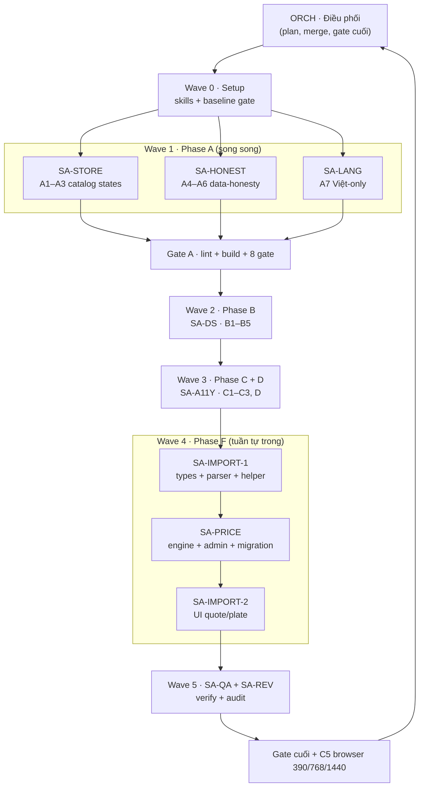

# UI/UX Dev Plan — VCUBE

> **Trạng thái**: IMPLEMENTED + VERIFIED (2026-09) — Phase A/B/C/D/F đã thi công qua 6 wave
> subagent; `lint` + `build` + 10 gate xanh (xem §6.1). Đã kiểm browser headless Playwright
> (Chromium) ở 390/768/1440: `/`, `/explore`, PDP, error+retry, empty, slow-skeleton, FAB —
> 27/27 PASS. MCP `playwright` đã cấu hình toàn cục (xem §6.2). Còn nợ: test matrix §4.10 cần
> file 3MF đã cắt thật (chưa có fixture trong repo).
> **Base**: `main` @ `400e4c8` (+ các thay đổi 2a–2d chưa commit).
> **Phạm vi đợt này**: frontend-only. Backend/security (orders/assets cho khách, payment
> webhook, auth hardening, demo mode) **tách track riêng**.
> **Ngôn ngữ**: tiếng Việt là ngôn ngữ duy nhất (sẽ gỡ toggle EN ở phase A7).
> **Bất biến**: Be Vietnam Pro + JetBrains Mono, lucide + `iconMap`, light-first,
> data-honesty (`check-fabricated`), token-only, không thêm dependency, không GSAP.
> **Luồng đọc tài liệu**: §0 (luồng + phân vai subagent) → §1 (đánh giá) → §2 (roadmap)
> → §3/§4 (spec chi tiết) → §5 (gate) → §6 (review log) → Phụ lục A/B.

---

## Mục lục

0. [Luồng thực thi & phân vai subagent](#0-luồng-thực-thi--phân-vai-subagent)
1. [Đánh giá tổng thể UI/UX](#1-đánh-giá-tổng-thể-uiux)
2. [Roadmap phát triển (6 phase)](#2-roadmap-phát-triển-6-phase)
3. [Chi tiết Phase A — A1 + A2 (+ A3-lite cho products)](#3-chi-tiết-phase-a--a1--a2--a3-lite-cho-products)
4. [Chi tiết Phase F — Import 3D: plate / grams / thời gian in + công thức năng suất admin](#4-chi-tiết-phase-f--import-3d-plate--grams--thời-gian-in--công-thức-năng-suất-admin)
5. [Gate không hồi quy](#5-gate-không-hồi-quy)
6. [Review log (3 subagent)](#6-review-log-3-subagent-read-only)
7. [Phụ lục A — Bảng file:line](#phụ-lục-a--bảng-fileline)
8. [Phụ lục B — Checklist thi công](#phụ-lục-b--checklist-thi-công)

---

## 0. Luồng thực thi & phân vai subagent

> Nguyên tắc: **một file chỉ có một owner trong một wave**. Subagent không tự commit/push.
> Mọi handoff phải kèm báo cáo theo mẫu §0.6. ORCH là bên duy nhất merge + chạy gate cuối.

### 0.1 Sơ đồ luồng



### 0.2 Danh sách subagent (roles)

| ID | Tên | Nhiệm vụ | File sở hữu (theo phase) | KHÔNG được đụng | Gate tự chạy |
|---|---|---|---|---|---|
| **ORCH** | Orchestrator | Điều phối wave, giữ plan, merge, chạy gate cuối, báo chủ dự án | `docs/tasks/UI-UX-DEV-PLAN.md` | mọi file `src/` | Toàn bộ gate cuối |
| **SA-STORE** | Storefront data-state | A1–A3: trạng thái loading/error/empty của catalog | `App.tsx`, `ExploreView.tsx`, `HomeView.tsx` | `pricingEngine`, `meshParser`, `ui/*` | lint, `check-icon-names`, `check-fabricated` |
| **SA-HONEST** | Data-honesty surfaces | A4–A6: bỏ số bịa ở quote/PDP/designer | `QuoteSummaryPanel.tsx`, `ProductDetailView.tsx`, `DesignerRequestsTab.tsx`, `DesignerUploadWizardTab.tsx`, `DesignerModelsManagerTab.tsx` | `App.tsx`, `pricingEngine.ts` | lint, `check-fabricated`, `check-contrast-combos` |
| **SA-LANG** | Vietnamese-only | A7: gỡ toggle EN, mặc định `vi` | `Header.tsx`, `UserAvatarMenu.tsx`, `LanguageContext.tsx` | `App.tsx` route logic | lint |
| **SA-DS** | Design-system | B1–B5: gate mới, Money, `border-line`, token, motion | `scripts/check-ui-rules.mjs` (mới), `index.css`, `ui/*`, `ServiceShowcaseSection.tsx`, call sites B2/B3/B5 | `App.tsx`, `ExploreView.tsx`, `HomeView.tsx` | lint, `check-contrast*`, gate mới |
| **SA-A11Y** | Console & a11y | C1–C3 + D: error boundary, tab ARIA, nhãn, polish | `admin/**`, `designer/**`, `CartView.tsx`, `ObjectTreePanel.tsx`, `TransformControlsPanel.tsx` | `App.tsx`, `ExploreView.tsx` | lint, `check-icon-names` |
| **SA-IMPORT-1** | 3D import core | F1–F3: types + parser + helper ước lượng | `types/index.ts`, `meshParser.ts`, `printEstimate.ts` (mới) | `pricingEngine.ts`, admin | lint |
| **SA-PRICE** | Pricing + admin config | F4–F6: engine, migration, mapper, form admin | `pricingEngine.ts`, `20260901_baseline_schema.sql`, `mappers.ts`, `database.ts`, `PricingConfigPanel.tsx` | `meshParser.ts`, `types` (đợi SA-IMPORT-1) | lint, `check-unitprice-multiplier`, `a8-sql-syntax-check`, `lint-rls-*` |
| **SA-IMPORT-2** | 3D import UI | F7: badge nguồn, grams/giờ per-plate | `QuoteSummaryPanel.tsx`, `ObjectTreePanel.tsx`, `ModelViewer3D.tsx`, `PresetPalettePanel.tsx` | engine, parser | lint, `check-contrast-combos` |
| **SA-QA** | Verification | E: chạy toàn bộ gate + C5 browser, không sửa code | — | mọi file `src/` | tất cả gate |
| **SA-REV** | Review (read-only) | Audit từng wave đối chiếu plan, báo lỗi tồn đọng | — | mọi file `src/` | đọc + báo cáo |

### 0.3 Ma trận task → subagent

| Task | Subagent | Wave | Song song với |
|---|---|---|---|
| A1–A3 | SA-STORE | 1 | SA-HONEST, SA-LANG |
| A4–A6 | SA-HONEST | 1 | SA-STORE, SA-LANG |
| A7 | SA-LANG | 1 | SA-STORE, SA-HONEST |
| B1–B5 | SA-DS | 2 | — |
| C1–C3 | SA-A11Y | 3 | — |
| D | SA-A11Y | 3 | — |
| F1–F3 | SA-IMPORT-1 | 4a | — |
| F4–F6 | SA-PRICE | 4b (sau 4a) | — |
| F7 | SA-IMPORT-2 | 4c (sau 4b) | — |
| E | SA-QA | 5 | SA-REV |
| Review | SA-REV | 5 | SA-QA |

### 0.4 Chi tiết từng role

#### ORCH — Orchestrator
- **Vào**: plan này + báo cáo từ các role.
- **Làm**: chia wave, gán việc, giữ file ownership, merge, chạy gate cuối, cập nhật plan.
- **Ra**: trạng thái phase, danh sách blocker, quyết định escalate chủ dự án.
- **Không**: tự sửa code trong `src/` (chỉ merge khi role khác xong).
- **DoD**: mọi wave có handoff; gate cuối xanh; plan cập nhật.

#### SA-STORE — Storefront data-state (A1–A3)
- **Vào**: §3 (spec A1+A2), code `App.tsx` / `ExploreView.tsx` / `HomeView.tsx`.
- **Làm**: theo §3.5, gồm `useCallback`, auth gate, revision guard, D7(a-safe), error/empty predicates.
- **Ra**: diff 3 file + `lint`/gate result.
- **Không**: đụng `pricingEngine`, `meshParser`, `ui/*`.
- **DoD**: test matrix §3.7 đạt; gate xanh; không double-fetch.

#### SA-HONEST — Data-honesty surfaces (A4–A6)
- **Vào**: §1 P0 #4/#5/#6, danh sách file.
- **Làm**: A4 bỏ "Hiệu lực"/manual-review giả; A5 bỏ default `'PLA Tough'`; A6 bỏ `650.000`/90% cứng.
- **Ra**: diff + `check-fabricated` xanh.
- **Không**: `App.tsx`, `pricingEngine.ts`.
- **DoD**: không còn chuỗi/số bịa; `check-fabricated` PASS.

#### SA-LANG — Vietnamese-only (A7)
- **Vào**: `Header.tsx`, `UserAvatarMenu.tsx`, `LanguageContext.tsx`.
- **Làm**: gỡ nút đổi ngôn ngữ; mặc định `vi`; **không** cần dọn hết nhánh `isVi` (để lại dead-code an toàn).
- **Ra**: diff + lint.
- **Không**: đổi logic route/auth.
- **DoD**: không còn control đổi EN; UI tiếng Việt nhất quán.

#### SA-DS — Design-system (B1–B5)
- **Vào**: §2 Phase B, `tokens.md`, `ui/index.ts`.
- **Làm**: B1 gate `check-ui-rules.mjs`; B2 Money; B3 codemod border; B4 token hex; B5 motion-reduce.
- **Ra**: gate mới + diff + cập nhật AGENTS/README.
- **Không**: `App.tsx`/`ExploreView`/`HomeView` (owner SA-STORE).
- **DoD**: gate mới PASS và không hồi quy 8 gate cũ.

#### SA-A11Y — Console & a11y (C1–C3, D)
- **Vào**: §2 Phase C/D, pattern `PanelErrorBoundary`, `Group5:299-313`.
- **Làm**: C1 boundary, C2 tab ARIA, C3 nhãn + empty state, D polish/dead code.
- **Ra**: diff + lint + `check-icon-names`.
- **Không**: catalog views.
- **DoD**: 1 panel lỗi không kéo trắng console; keyboard focus ring đủ.

#### SA-IMPORT-1 — 3D import core (F1–F3)
- **Vào**: §4.3–4.6.
- **Làm**: thêm type, `printEstimate.ts`, sửa parser P1–P9.
- **Ra**: diff + lint + test parse 3MF/STL.
- **Không**: engine/admin.
- **DoD**: không tạo dữ liệu giả; plate↔part đúng; tổng giờ = Σ bàn.

#### SA-PRICE — Pricing + admin config (F4–F6)
- **Vào**: §4.3, §4.7, §4.8 (sau khi SA-IMPORT-1 xong types).
- **Làm**: engine dùng provenance, migration nullable, mapper/DB, form admin + validate.
- **Ra**: diff + `check-unitprice-multiplier` + `a8-sql-syntax-check` + `lint-rls-*`.
- **Không**: parser/helper.
- **DoD**: throughput `null` không bị thay bằng số mặc định; giá đổi khi sửa cấu hình.

#### SA-IMPORT-2 — 3D import UI (F7)
- **Vào**: §4.9 (sau SA-PRICE).
- **Làm**: badge nguồn ở quote, grams/giờ per-plate ở plate dock/tree.
- **Ra**: diff + lint + `check-contrast-combos`.
- **Không**: engine/parser.
- **DoD**: nguồn hiển thị đúng `slicer` / `throughput` / `volume_estimate`.

#### SA-QA — Verification (E)
- **Vào**: code đã merge của từng wave.
- **Làm**: chạy `lint` + `build` + toàn bộ gate; C5 browser 390/768/1440; không sửa code.
- **Ra**: báo cáo PASS/FAIL kèm `file:line` lỗi.
- **DoD**: mọi gate xanh; checklist §2.6 có kết quả từng mục.

#### SA-REV — Review read-only
- **Vào**: plan + diff từng wave.
- **Làm**: audit đối chiếu plan, tìm lỗi tồn đọng, đề xuất chỉnh plan.
- **Ra**: danh sách phát hiện (verdict + file:line + fix).
- **DoD**: không còn phát hiện mức Major chưa xử lý.

### 0.5 Giao thức phối hợp & chống xung đột

1. **File ownership**: một file chỉ một owner trong một wave (§0.2). Cần sửa file ngoài quyền ⇒
   gửi yêu cầu cho owner, không tự sửa.
2. **Handoff**: mỗi role kết thúc bằng báo cáo §0.6; ORCH chỉ chuyển wave khi có handoff.
3. **Gate nội bộ trước handoff**: role phải tự chạy gate mình phụ trách; fail ⇒ không handoff.
4. **Không commit/push**: mọi thay đổi để ORCH/chủ dự án quyết định.
5. **Bất biến chung** (mọi role): Be Vietnam Pro + JetBrains Mono, lucide + `iconMap`,
   light-first, data-honesty, token-only, không thêm dependency, không GSAP.
6. **Wave dependency**: Wave 2 (DS) chạy sau Wave 1 để tránh churn; Phase F tuần tự
   4a→4b→4c vì dùng chung `types/index.ts` và thứ tự engine cần types mới.

### 0.6 Mẫu báo cáo handoff (bắt buộc)

```md
## Handoff — <ROLE> — <task IDs>
- Wave: <n>
- Files changed: <path:line ranges>
- Commands run: <cmd> → <PASS/FAIL + output ngắn>
- Acceptance: <checklist §/task> → <đạt/chưa + lý do>
- Blocker / cần owner khác: <none | file + yêu cầu>
- Ghi chú data-honesty: <đã giữ bất biến? evidence>
```

### 0.7 Trách nhiệm gate theo role

| Gate | Owner chính | Khi nào |
|---|---|---|
| `lint` + `build` | mỗi role | trước mọi handoff |
| `check-fabricated` | SA-HONEST | A4–A6 |
| `check-contrast*` | SA-DS, SA-IMPORT-2 | B, F7 |
| `check-icon-names` | SA-STORE, SA-A11Y | A, C |
| `check-unitprice-multiplier` | SA-PRICE | F5 |
| `check-ui-rules.mjs` (mới) | SA-DS | B1 trở đi |
| `lint-rls-*`, `a8-sql-syntax-check` | SA-PRICE | F4 |
| Toàn bộ gate + C5 | SA-QA, ORCH | cuối mỗi phase + cuối dự án |

---

## 1. Đánh giá tổng thể UI/UX

### 1.1 Điểm mạnh (nền đã tốt)

- **Design token đầy đủ + có gate tương phản**: `src/index.css` khoá font / type scale /
  radius / elevation / z-index / motion; `check-contrast`, `check-contrast-combos`,
  `check-fabricated` chạy xanh.
- **Primitives có thật**: `Modal` / `Sheet` (`<dialog>` + focus trap + ref-count scroll
  lock), `DataTable`, `Field`, `EmptyState`, `Skeleton`, `PanelErrorBoundary`,
  `ConfirmDialog`.
- **Chuyển modal gần xong**: 6 `fixed inset-0` còn lại đều hợp lệ (viewer 3D fullscreen,
  backdrop mobile `AdminSidebar`, lớp nền trang trí Home/Explore) — không còn overlay tự chế.
- **Data-honesty đã dọn phần lớn**: `mockData.ts` rỗng (347 dòng, mọi export là `[]`),
  `isPaid:false` khi chưa thanh toán, invoice không bịa VAT 8%, cost modal đã gate
  `role === 'admin'`, order resolve theo id nghiêm ngặt.
- **State 4 lớp rõ** ở `WorkshopSettingsView`, `CheckoutView`, `Tool3DView`
  (loading / empty / error / retry).
- **A11y nền**: `Button` ép `aria-label` ở tầng type khi `iconOnly`; `AppShell` có
  skip-link + landmark.

### 1.2 Điểm yếu (xếp theo mức độ)

#### P0 — Sai trên bề mặt khách hàng (không phải polish)

| # | Vấn đề | file:line |
|---|---|---|
| 1 | `/orders` không nạp đơn cho khách (chỉ admin gọi `getOrders()`) → F5 mất lịch sử | `App.tsx:815-826`, `MyOrdersView.tsx:41,187` |
| 2 | `/assets` session-only → F5 mất file đã mua | `App.tsx:626,1290`, `AssetLibraryView.tsx:143` |
| 3 | `/explore` empty giả do timer 1200ms, thiếu `productsLoading` + error/retry | `ExploreView.tsx:37,166,371` vs `App.tsx:1477` |
| 4 | `/quote` bịa "Hiệu lực `<today+7d>`" + giả gửi thẩm định "phản hồi 30 phút" | `QuoteSummaryPanel.tsx:244-246,511,269-276,609-613` |
| 5 | PDP ghi cứng vật liệu `'PLA Tough'` vào cart/đơn | `ProductDetailView.tsx:58,148` |
| 6 | Designer toast `650.000 đ` cứng + royalty 90% cứng | `DesignerRequestsTab.tsx:152`, `DesignerUploadWizardTab.tsx:434`, `DesignerModelsManagerTab.tsx:432` |
| 7 | Lỗi DB bị `console.warn` → UI coi như kho rỗng | `App.tsx:707-808` |
| 8 | **Gram/thời gian in bị bỏ qua hoặc bịa**: 3MF đã cắt có `used_g`/`prediction` nhưng parser không dùng; engine luôn suy `volume × density` và `volume×3.8/(layer×100)`; STL/STEP không có nguồn thời gian (PC-05, MP-13) | `meshParser.ts:704-773,1166-1197`; `pricingEngine.ts:467-476` |

#### P1 — Design-system chưa đạt chuẩn

- `<Money>` **0 consumer** dù `ui/index.ts` bắt buộc; **109** `toLocaleString`, nhiều chỗ
  không guard `NaN` (`InternalCostBreakdownModal`, `CartDrawer`, `CheckoutView`, …).
- **140 control thô** dùng `border-line` (1.42:1 — `tokens.md:30` cấm cho viền control);
  nặng: `AdminStorefrontPanel` (51), `Group1WorkshopsPanel` (32), `AccessoriesManager` (25).
- `<Field>` chưa tới admin (`Group1` 32 control 0 label; `AccessoriesManager` 25;
  `AdminStorefrontPanel` 51 raw / 1 `htmlFor`).
- `focus:outline-none` thiếu ring (`Group1` 31, `AdminStorefrontPanel` 18).
- **30 file animation vô hạn không `motion-reduce`** (`PageSkeleton`, `OrderProgress`,
  `HomeView:292` ping).
- `ServiceShowcaseSection.tsx` hardcode 5 hex theme + 1 `border-white`.
- `transition-all` ×166, `key={idx}` ×12.

#### P2 — Console UX & a11y

- Không có `PanelErrorBoundary` cho admin/designer; 1 panel lỗi → trắng cả console
  (`AdminDashboardView.tsx:318-447`, `DesignerDashboardView.tsx:83-129`).
- 3D viewer storefront không có `CanvasErrorBoundary` (`HomeView:452`,
  `ProductDetailView:354`, `PersonalizeView:357`).
- Tabs thiếu `role=tab`/`aria-selected` (PDP, `PricingConfigPanel`, `TransformControlsPanel`,
  `ValidationReportPanel`).
- Input thiếu nhãn: `ObjectTreePanel`, `TransformControlsPanel`, search `MyOrdersView:148`,
  `WarehouseInventoryPanel:526`, `Group3CustomersPanel:593`; quantity stepper
  `CartView:333-347`.
- `ObjectTreePanel` không có empty state (`{0} Part`).

#### P3 — i18n & polish

- EN toggle vô tác dụng ở `/quote`, `/personalize`, `/orders`, `/tracking`, `/assets`,
  `/designer` (0 `isVi`) → sẽ gỡ EN (A7).
- Eyebrow overuse: 204 dòng `text-xs + uppercase + tracking-wider`.
- Dead code: `AdminSidebar` component, `admin.ts`, fallback id `'bambu-x1c'` / `'pla-tough'`.

### 1.3 Ngoài UI/UX nhưng chặn production (track riêng)

- Nạp `orders` cho khách (`OrderService.getOrdersByCustomer` chưa dùng).
- Nạp `digital_assets` cho `/assets`.
- Payment: VietQR/VNPAY chưa có webhook xác nhận (`awaiting_payment`).
- Auth: `switchDemoRole`, `DEMO_ACCOUNTS` + mật khẩu cứng, Google OAuth tự tạo identity bịa.

---

## 2. Roadmap phát triển (6 phase)

Thứ tự đã chốt với chủ dự án: **đúng trước, đẹp sau** (A → B → C → D), E chốt.

### Phase A — "Khách dùng được thật" (P0)

| ID | Role | Việc | File | Nghiệm thu |
|---|---|---|---|---|
| A1 | SA-STORE | `/explore` bỏ timer 1200ms; nhận `productsLoading`; error + retry (chi tiết §3) | `ExploreView.tsx` | Mạng chậm không hiện "kho trống"; lỗi có retry |
| A2 | SA-STORE | `HomeView` phân biệt lỗi tải vs kho rỗng vs filter-miss; error + retry (chi tiết §3) | `HomeView.tsx` | Lỗi hiện banner, không đổ cho filter |
| A3 | SA-STORE | `App.tsx` surface lỗi loader (đợt này **chỉ products**) | `App.tsx` | Lỗi đọc catalog hiện thông báo, không im lặng |
| A4 | SA-HONEST | `/quote` bỏ "Hiệu lực"; thay manual-review giả bằng trạng thái trung thực | `QuoteSummaryPanel.tsx` | Không còn "30 phút"/"Hiệu lực" |
| A5 | SA-HONEST | PDP bỏ default `'PLA Tough'`; buộc chọn vật liệu khi seller chưa khai | `ProductDetailView.tsx` | Đơn không chứa vật liệu không tồn tại |
| A6 | SA-HONEST | Designer bỏ `650.000` + royalty cứng; đọc từ pricing config | `DesignerRequestsTab.tsx`, `DesignerUploadWizardTab.tsx`, `DesignerModelsManagerTab.tsx` | Không còn số cứng |
| A7 | SA-LANG | Gỡ toggle EN (Header + UserAvatarMenu), mặc định `vi`; dọn nhánh EN sau | `Header.tsx`, `UserAvatarMenu.tsx`, `LanguageContext.tsx` | UI luôn tiếng Việt nhất quán |

**Blocked by backend**: `/orders`, `/assets`, payment, auth hardening.

### Phase B — Design-system hardening (P1)

1. **B1**: viết `scripts/check-ui-rules.mjs` (mới) chặn hồi quy:
   `border-line` trên input/select/textarea, `toLocaleString(` không guard (heuristic),
   `focus:outline-none` không kèm ring, `animate-*` vô hạn không `motion-reduce`.
   Thêm vào AGENTS gate list + `docs/README.md` §6.
2. **B2**: adopt `Money`/`formatNumber` ở `CartDrawer`, `CartView`, `CheckoutView`,
   `InternalCostBreakdownModal`.
3. **B3**: codemod `border-line` → `border-line-control` cho control (ưu tiên admin).
4. **B4**: `ServiceShowcaseSection` đọc hex từ `theme/tokens.ts`, bỏ `border-white`.
5. **B5**: thêm `motion-reduce` cho 30 file animation vô hạn (`PageSkeleton`,
   `OrderProgress`, `HomeView:292`, …).

### Phase C — Console UX & a11y (P2)

1. `PanelErrorBoundary` cho admin/designer; `CanvasErrorBoundary` cho 3D storefront.
2. Tab ARIA (`role=tab`/`aria-selected`/`aria-controls`).
3. Gắn nhãn input thiếu; empty state `ObjectTreePanel`.

### Phase D — Polish & dọn dẹp (P3)

- Giảm eyebrow; đổi `transition-all` → `transition-colors`/`transform`; thay `key={idx}`.
- Dọn dead code (`AdminSidebar`, `admin.ts`, fallback id cứng).

### Phase E — Verification (xuyên suốt)

- Mỗi phase: `npm run lint` + `npm run build` + 8 gate (+ gate B1 khi xong).
- C5 browser 390/768/1440 theo checklist §2.6 của `docs/tasks/UI-REFACTOR-NEXT-STEPS.md`.
- Cập nhật `docs/design/ui-audit-2026-09.md`.

### Phase F — Import 3D: plate / grams / thời gian in + năng suất admin (P1, chi tiết §4)

Mục tiêu: khi import STL/3MF, lấy tối đa dữ liệu thật từ file (số bàn, gram/bàn, tổng gram,
thời gian in); nếu file không có thì **ước lượng** từ năng suất máy do admin khai (ví dụ
100g/3h) và **dán nhãn nguồn** để tính giá đúng và trung thực.

| ID | Role | Việc | File |
|---|---|---|---|
| F1 | SA-IMPORT-1 | Tách helper `printEstimate.ts` (grams/time + provenance) | `src/utils/printEstimate.ts` (mới) |
| F2 | SA-IMPORT-1 | Parser: gán `plateIndex` thật, cộng thời gian **tất cả** bàn, per-plate bbox, không bịa extruder | `src/utils/meshParser.ts` |
| F3 | SA-IMPORT-1 | Kiểu dữ liệu: `PrinterProfile.throughputGramsPerHour`, provenance trong `DetailedCostBreakdown`, field grams/time trên `AnalysisFile` | `src/types/index.ts` |
| F4 | SA-PRICE | Migration: `printer_fleet.throughput_grams_per_hour numeric` (nullable) | `supabase/migrations/20260901_baseline_schema.sql` |
| F5 | SA-PRICE | Engine: ưu tiên slicer time → throughput → volume, gắn tag nguồn | `src/utils/pricingEngine.ts` |
| F6 | SA-PRICE | Admin: ô nhập năng suất (g/giờ) trong printer form + map + save | `PricingConfigPanel.tsx`, `mappers.ts`, `database.ts` |
| F7 | SA-IMPORT-2 | UI: hiện grams/time + badge nguồn ở quote, per-plate ở plate dock/tree | `QuoteSummaryPanel.tsx`, `ObjectTreePanel.tsx`, `ModelViewer3D.tsx` |

---

## 3. Chi tiết Phase A — A1 + A2 (+ A3-lite cho products)

### 3.1 Mục tiêu

1. `/explore` không còn empty giả sau 1.2s; phản ánh đúng **đang tải / lỗi / rỗng thật**.
2. `/` phân biệt **lỗi tải** vs **kho rỗng** vs **filter không khớp**.
3. Retry thật, không double-fetch, không setState sau unmount.
4. Giữ nguyên realtime, cache, các luồng khác.

### 3.2 Deep research — sự thật & ràng buộc (đã kiểm chứng bằng code)

| # | Sự thật | Bằng chứng |
|---|---|---|
| F1 | `getProducts()` **ném lỗi** khi Supabase trả error | `database.ts:170-174` |
| F2 | `seedInitialProductsIfEmpty()` **luôn trả `false`**, không seed, có thể ném lỗi khi count query fail | `database.ts:243-258` |
| F3 | `products` khởi tạo từ `localStorage['vcube_products']` rồi `PRODUCTS` (rỗng) | `App.tsx:589-597` |
| F4 | Cache chỉ **ghi** khi admin add/edit/delete; không ghi khi fetch, không xoá khi DB rỗng | `App.tsx:1302-1353` |
| F5 | `productsLoading` khởi tạo `true`, chỉ `false` trong `.finally` | `App.tsx:599,721-723` |
| F6 | Effect fetch + realtime chung một `useEffect` | `App.tsx:703-777` |
| F7 | Explore chưa nhận `productsLoading`; dùng timer cứng 1200ms | `App.tsx:105-112,1477-1486`; `ExploreView.tsx:14-25,37,138,160-168,371` |
| F8 | Home đã nhận `productsLoading`; gate render ở `:776-809` | `App.tsx:1458-1472`; `HomeView.tsx:776` |
| F9 | Empty state Home luôn đổ lỗi cho filter, không phân biệt kho rỗng | `HomeView.tsx:788-808` |
| F10 | `catalogIsEmpty` = `catalogProducts.length===0` (đã role-lọc) | `ExploreView.tsx:236-239,372` |
| F11 | Quy ước lỗi/retry có sẵn: hộp `bg-danger-tint` + nút "Thử lại" | `Group5ProductionPanel.tsx:299-313`; `Group1WorkshopsPanel.tsx:887-904` |
| F12 | `EmptyState` API: `title`, `description` (bắt buộc), `icon`, `action`, `live`, `bordered` | `EmptyState.tsx:22-33` |
| F13 | `Button` có `loading`/`loadingLabel`; icon `refresh` có trong iconMap | `Button.tsx:36-37,152-157`; `iconMap.ts:443` |
| F14 | RLS: anon/authenticated chỉ đọc `status in ('published','Published')`; admin full | `20261010_harden_rls.sql:320-324` |
| F15 | AuthContext expose `loading` | `AuthContext.tsx:25,117,456` |
| F16 | `useCallback` chưa import ở `App.tsx` | `App.tsx:1` |
| F17 | `check-fabricated` cấm `N giây`, `100%`, `±0.05mm`, ISO, hotline… | `scripts/check-fabricated.mjs:32-76` |

**Hệ quả quan trọng (F2 + F4):** nếu DB đọc thành công nhưng rỗng, code hiện tại **không**
`setProducts([])` → cache localStorage cũ vẫn hiển thị, nên nhánh "rỗng thật" của A2 không
bao giờ chạy nếu còn cache. → Cần D7 (đã chốt).

### 3.3 Quyết định đã chốt

- **D1 = 1A**: `productsError` boolean; UI copy chung; lỗi thật chỉ `console.warn`
  (không lộ `err.message`).
- **D2 = 2A**: lỗi + còn cache → giữ nội dung + dải cảnh báo nhỏ (`role="status"`), không
  chặn trang.
- **D7 = (a-safe)**: mọi fetch thành công → `setProducts(remote)` kể cả `[]`;
  `localStorage.removeItem('vcube_products')` **chỉ khi**: auth đã resolve + fetch thành
  công + revision không đổi.
- **D3**: thứ tự gate render: `loading` → `error && empty-cache` → `empty` → `content`.
- **D4**: nút retry dùng `Button variant="secondary" size="sm" loading={productsLoading}`
  + icon `refresh`; disable khi đang tải.
- **D5**: copy mới song ngữ `isVi ? vi : en` để khớp code hiện tại (EN gỡ ở A7).
- **D6**: realtime effect tách riêng nhưng **giữ y nguyên** nội dung + cleanup.

### 3.4 State model

```
                 mount
                   │
        authLoading? ──yes──> chờ
                   │ no
             productsLoading = true
                   │
        ┌──────────┴───────────┐
   getProducts OK          getProducts THROW
        │                       │
  revision đổi?            productsError = true
    ├─ có  → bỏ qua          │
    └─ không → setProducts   products.length===0 ?
              remote.length?   ├─ true  → ErrorState + Retry
               ├─ >0 → content └─ false → content + WarningStrip
               └─ =0 → empty (xoá cache có guard)
```

### 3.5 Thay đổi theo file

#### 3.5.1 `src/App.tsx`

**(a) Import** — thêm `useCallback` (F16):

```ts
import React, { useState, useEffect, useMemo, useRef, useCallback } from 'react';
```

**(b) State/refs** — đặt cạnh `productsLoading` (`:599`):

```ts
const [productsError, setProductsError] = useState(false);
const mountedRef = useRef(true);
const productsLoadingRef = useRef(false);
const productsRevisionRef = useRef(0);
```

**(c) Auth** — lấy `loading`:

```ts
const { user, role, isLoggedIn, loading: authLoading } = useAuth();
```

**(d) `loadProducts`** — thay khối `.then` trong effect `:703-723`; **bỏ**
`seedInitialProductsIfEmpty()` (F2):

```ts
const loadProducts = useCallback(async () => {
  if (productsLoadingRef.current) return;      // chống double-fetch / StrictMode
  productsLoadingRef.current = true;
  setProductsLoading(true);
  setProductsError(false);
  const startRev = productsRevisionRef.current;
  try {
    const remote = await dbService.getProducts();          // RLS quyết định; bỏ seed
    if (!mountedRef.current) return;
    if (productsRevisionRef.current !== startRev) return;  // nhường realtime/admin mới hơn
    setProducts(remote);
    if (remote.length === 0) {
      // D7(a-safe): DB xác nhận rỗng và không lỗi ⇒ xoá cache để empty-state nói thật.
      try { localStorage.removeItem('vcube_products'); } catch { /* bỏ qua */ }
    }
  } catch (err) {
    console.warn('[vcube] Could not sync remote products:', err);
    if (mountedRef.current) setProductsError(true);        // giữ cache hiện có (D2)
  } finally {
    productsLoadingRef.current = false;
    if (mountedRef.current) setProductsLoading(false);
  }
}, []);
```

**(e) Effect mount + effect gọi fetch**:

```ts
useEffect(() => {
  mountedRef.current = true;
  return () => { mountedRef.current = false; };
}, []);

useEffect(() => {
  if (authLoading) return;                                 // F15/F14: chờ auth để tránh anon []
  void loadProducts();
}, [authLoading, user?.id, role, loadProducts]);
```

**(f) Realtime effect tách riêng** — giữ nguyên nội dung `App.tsx:725-777` +
`return () => supabase.removeChannel(channel)`, deps `[]`; bump revision trong cả 3 nhánh:

```ts
if (payload.eventType === 'INSERT') {
  productsRevisionRef.current++;
  setProducts((prev) => { ... });
} else if (payload.eventType === 'UPDATE') {
  productsRevisionRef.current++;
  setProducts((prev) => ...);
} else if (payload.eventType === 'DELETE') {
  productsRevisionRef.current++;
  setProducts((prev) => prev.filter(...));
}
```

**(g) Bump revision trong 3 handler admin** (`handleAddNewProduct` / `handleUpdateProduct`
/ `handleDeleteProduct`, `App.tsx:1297-1355`) ngay trong `setProducts` updater.

**(h) Wire props**:

- Home (`:1458-1472`): thêm `productsError={productsError}`,
  `onRetryProducts={loadProducts}`.
- `ExploreRoute` (`:105-112`): thêm `productsLoading?`, `productsError?`, `onRetry?`;
  forward xuống `ExploreView` (`:120-131`).
- Route `/explore` (`:1477-1486`): truyền 3 prop mới.
- `ProductDetailRoute` (`:135-186`): nhận `productsLoading`/`productsError`/`onRetry`,
  sửa gate kẹt spinner:

```tsx
if (product) return <ProductDetailView ... />;
if (productsLoading) {
  return (
    <div role="status" className="min-h-dvh bg-canvas flex items-center justify-center p-6">
      <div className="text-center space-y-3">
        <div className="w-12 h-12 border-3 border-primary border-t-transparent rounded-full animate-spin motion-reduce:animate-none mx-auto" />
        <p className="font-mono text-xs text-fg-subtle">Đang tải thông số kỹ thuật mô hình 3D...</p>
      </div>
    </div>
  );
}
if (productsError) {
  return ( /* EmptyState lỗi + nút "Thử lại" gọi onRetry, role="alert" */ );
}
return <OrderNotFoundView onNavigate={onNavigate} context="order-success" />;
```

> Lưu ý: `OrderNotFoundView` hiện có `context="order-success"`; PDP dùng thông điệp
> "Không tìm thấy bản vẽ CAD này" hiện có ở `App.tsx:157-172` — giữ nguyên phần not-found,
> chỉ chèn nhánh loading/error phía trước.

#### 3.5.2 `src/frontend/views/ExploreView.tsx`

- **Interface** (`:14-25`) + destructure (`:104-117`): thêm
  `productsLoading?: boolean`, `productsError?: boolean`, `onRetry?: () => void`.
- **Xoá**: `CATALOG_HYDRATION_WINDOW_MS` (`:37`), state `hydrationWindowOpen` (`:138`),
  effect timer (`:160-168`).
- **Predicate** theo `catalogProducts` (đã role-lọc — tránh warning nói dối):

```ts
const hasVisible = catalogProducts.length > 0;
const isCatalogLoading = Boolean(productsLoading) && products.length === 0;
const showError = Boolean(productsError) && !hasVisible && !isCatalogLoading;
const showWarning = Boolean(productsError) && hasVisible;
```

- **Render** (`:855-917`), dải cảnh báo đặt **trên** state switch:

```tsx
{showWarning && (
  <p role="status"
     className="flex items-center gap-2 rounded-md border border-warning/30 bg-warning-tint px-3 py-2 text-xs text-warning">
    <Icon name="warning" size={16} />
    {isVi ? 'Không làm mới được kho — đang hiển thị dữ liệu lần trước.'
          : 'Could not refresh the catalogue — showing previous data.'}
  </p>
)}

{isCatalogLoading ? (
  /* skeleton hiện có */
) : showError ? (
  <div role="alert">
    <EmptyState
      icon={<Icon name="error" size={20} />}
      title={isVi ? 'Không tải được kho bản vẽ' : 'Could not load the catalogue'}
      description={isVi
        ? 'Không kết nối được tới máy chủ dữ liệu. Kiểm tra kết nối mạng rồi thử lại.'
        : 'Could not reach the data server. Check your connection and try again.'}
      action={<>
        <Button variant="secondary" size="md"
          loading={Boolean(productsLoading)}
          loadingLabel={isVi ? 'Đang tải…' : 'Loading…'}
          leadingIcon={<Icon name="refresh" size={18} />}
          onClick={() => onRetry?.()}>
          {isVi ? 'Thử lại' : 'Retry'}
        </Button>
        <Button variant="primary" size="md" onClick={goToQuote}
          leadingIcon={<Icon name="request_quote" size={18} />}>
          {isVi ? 'Báo giá file 3D của bạn' : 'Quote your own 3D file'}
        </Button>
      </>}
    />
  </div>
) : filteredProducts.length === 0 ? (
  /* empty state hiện có (:866-917) */
) : viewMode === 'grid' ? (
  /* grid */
) : (
  /* table */
)}
```

- **Không early-return**: giữ `CadQuickViewModal` (`:1331-1341`) và `Sheet` filter mobile
  (`:1306-1328`) luôn mount.
- EmptyState error **không** truyền `live` (tránh `role=status` lồng trong `role=alert`).

#### 3.5.3 `src/frontend/views/HomeView.tsx`

- **Interface** (`:15-26`) + destructure (`:102-112`): thêm `productsError?: boolean`,
  `onRetryProducts?: () => void`.
- **Skeleton** (`:776-787`): thêm `role="status"` + `aria-label` (đồng bộ Explore).
- **Gate render** (`:776-809`):

```tsx
{productsLoading && products.length === 0 && displayedProducts.length === 0 ? (
  /* skeleton (thêm role="status") */
) : Boolean(productsError) && products.length === 0 ? (
  <Card padding="none">
    <div role="alert">
      <EmptyState /* copy lỗi như Explore, action retry + Báo giá */ />
    </div>
  </Card>
) : displayedProducts.length === 0 ? (
  <Card padding="none">
    <EmptyState
      bordered={false}
      icon={<Icon name={products.length === 0 ? 'inventory_2' : 'search_off'} size={20} />}
      title={products.length === 0
        ? (isVi ? 'Kho bản vẽ đang trống' : 'The catalogue is empty')
        : (isVi ? 'Không tìm thấy linh kiện CAD phù hợp' : 'No CAD parts match your criteria')}
      description={products.length === 0
        ? (isVi ? 'Chưa có bản vẽ CAD nào được đăng trên VCUBE.'
                : 'No CAD model has been published on VCUBE yet.')
        : (isVi ? 'Bộ lọc hiện tại không khớp bản vẽ nào trong kho — thử xóa từ khóa hoặc đổi danh mục.'
                : 'The current filters match nothing in the library — clear the query or switch category.')}
      action={products.length === 0 ? (
        <Button size="sm" onClick={() => handleProtectedAction(() => onNavigate('tool_3d'))}>
          {isVi ? 'Tải file CAD của bạn' : 'Upload your CAD file'}
        </Button>
      ) : (
        <Button size="sm" onClick={() => { setCadSearch(''); setSelectedCategory('all'); setSelectedTag('all'); }}>
          {isVi ? 'Hiển thị tất cả bản vẽ' : 'Reset All Filters'}
        </Button>
      )}
    />
  </Card>
) : catalogViewMode === 'grid' ? ( /* grid */ ) : ( /* table */ )}
```

- **Warning strip** đặt ngay trước gate, khi `productsError && products.length > 0`:

```tsx
{productsError && products.length > 0 && (
  <p role="status"
     className="flex items-center gap-2 rounded-md border border-warning/30 bg-warning-tint px-3 py-2 text-xs text-warning">
    <Icon name="warning" size={16} />
    {isVi ? 'Không làm mới được kho — đang hiển thị dữ liệu lần trước.'
          : 'Could not refresh the catalogue — showing previous data.'}
  </p>
)}
```

### 3.6 Thứ tự thi công

1. `App.tsx` bước (a)→(h) → `npm run lint`.
2. `ExploreRoute` + `ExploreView` → lint.
3. `HomeView` → lint.
4. `npm run build` + 8 gate.
5. Kiểm thủ công mục 3.7.

### 3.7 Test matrix

| Case | Cách giả lập | Kỳ vọng |
|---|---|---|
| Slow | DevTools throttle Slow 3G | Skeleton > 1.2s tới khi data về |
| DB error | Ngắt mạng / sai URL | Error + retry ở `/`, `/explore`, PDP |
| Error + cache | Có `vcube_products`, rồi ngắt mạng | Nội dung cũ + warning |
| Empty | DB published rỗng | Empty thật (Home phân biệt filter) |
| Retry | Bấm "Thử lại" khi online lại | Data hiện, warning/error biến mất |
| Realtime | Thêm product ở tab admin khác | Xuất hiện không cần reload |
| Auth race | F5 liên tục | Không xoá cache khi auth chưa resolve |

### 3.8 Acceptance criteria

- [ ] Bỏ mốc 1.2s; skeleton tới khi `productsLoading=false` (chỉ khi chưa có data).
- [ ] Lỗi: error + `role="alert"` + "Thử lại" (nút loading) ở `/`, `/explore`, PDP.
- [ ] Lỗi + cache: nội dung cũ + warning, không chặn trang.
- [ ] Rỗng thật (auth resolved): empty state hiển thị; cache cũ bị xoá có guard.
- [ ] Không double-fetch (StrictMode); không đè realtime/admin (revision); realtime vẫn chạy.
- [ ] `npm run lint` + `npm run build` + 8 gate xanh.
- [ ] Kiểm 390/768/1440.

### 3.9 Rủi ro & rollback

| Rủi ro | Giảm thiểu |
|---|---|
| Race auth/anon-empty (F14/F15) | Gate `!authLoading` + re-fetch theo `user?.id`/`role` + revision guard |
| StrictMode double-invoke | `productsLoadingRef` |
| Last-write-wins đè realtime/admin | `productsRevisionRef` |
| Copy chạm `check-fabricated` | Đã rà F17; copy an toàn |
| Retry khi in-flight bị nuốt | Nút retry `loading`/`disabled` khi `productsLoading` |

**Rollback**: revert 3 file `App.tsx`, `ExploreView.tsx`, `HomeView.tsx`.

### 3.10 Ngoài scope (ghi nhận)

- A3 đầy đủ (materials/printers/accessories/pricing/site_content).
- A7 (gỡ EN) dọn nhánh `isVi` sau.
- Backend track: `/orders`, `/assets`, payment, auth.
- `docs/design/qa-checklist.md:159` mô tả clear `vcube_products` — cập nhật ở phase docs.
- `scripts/test-catalog-sync.ts` không bị ảnh hưởng (assert hiện đã vacuous `0 === 0`).

---

## 4. Chi tiết Phase F — Import 3D: plate / grams / thời gian in + công thức năng suất admin

### 4.1 Mục tiêu

Khi import STL / 3MF / OBJ / STEP, hệ thống phải **linh động** lấy tối đa dữ liệu thật từ
file và, khi file không có, **ước lượng có kiểm soát** rồi tính giá đúng:

1. **Số bàn in (plate count)** và **thành viên từng bàn**.
2. **Gram/bàn**, **tổng gram**.
3. **Thời gian in/bàn** và **tổng thời gian in** (nếu file có dữ liệu slicer).
4. Nếu file **không** có thời gian: dùng **công thức năng suất do admin khai** trên máy in
   (ví dụ "100 g / 3 h" ⇒ 33.33 g/giờ) để suy ra giờ in từ tổng gram.
5. Mọi giá trị không đo được phải **gắn nhãn nguồn** (`từ file` / `ước tính`) — không được
   trình bày như số đo thật (data-honesty PC-05, MP-13).

### 4.2 File cho được gì (đã kiểm chứng)

| Định dạng | Plate | Gram/bàn | Tổng gram | Thời gian in | file:line |
|---|---|---|---|---|---|
| 3MF đã cắt (Bambu Studio / OrcaSlicer) | Có (`slice_info.config <plate>`) | Có (`<plate weight>` / `filament_weight`) | Có (`<filament used_g>` tổng) | Có (`<plate prediction>`) | `meshParser.ts:704-773,852-855` |
| 3MF thô (chỉ hình học) | Không (synthetic) | Không | Không | Không | `meshParser.ts:1183-1197` |
| STL / OBJ / STEP / IGES | Không | Không | Không | Không | `meshParser.ts:1589-1691` |
| 3MF lỗi native parser (fallback `ThreeMFLoader`) | Mất metadata | Mất | Mất | Mất | `meshParser.ts:1542-1550` |

**Kết luận:** chỉ 3MF đã cắt mới có số đo thật. Gram hiện được engine tự suy cho mọi định
dạng (`pricingEngine.ts:467`), còn thời gian in là heuristic thể tích (`:474`). Đây là lỗ
cần bịt bằng Phase F.

### 4.3 Mô hình dữ liệu

**Types (`src/types/index.ts`)**

- `PrinterProfile` (`:434-452`): thêm
  ```ts
  /** Năng suất in khai báo (g/giờ). `null` = CHƯA KHAI (khác 0). */
  throughputGramsPerHour: number | null;
  ```
- `DetailedCostBreakdown` (`:456+`): thêm provenance
  ```ts
  gramsSource: 'slicer' | 'volume_estimate';
  printHoursSource: 'slicer' | 'throughput' | 'volume_estimate';
  throughputGramsPerHourUsed?: number | null;
  ```
- `AnalysisFile` (`:561-597`): **giữ** `slicerPreset` + `plates` (đã parse, hiện bị bỏ không).
  Không cần field mới cho dữ liệu file; helper ở §4.5 chuẩn hoá truy cập.

**DB (`supabase/migrations/20260901_baseline_schema.sql`)** — thêm 1 cột nullable, theo
đúng tiền lệ `materials.failure_extra_percent` (`:631-643`), KHÔNG tạo migration mới:

```sql
alter table public.printer_fleet
  add column if not exists throughput_grams_per_hour numeric;  -- NULL = chưa khai
```

RLS không đổi: `printer_fleet` đã có public read / admin write
(`harden_rls.sql:1246`, `20260901:1508`).

### 4.4 Luồng xử lý

```
upload file
   │
parse3DFile (meshParser)  ──► AnalysisFile { volume, parts, plates?, slicerPreset? }
   │
handleActualFileUpload (Tool3DView:413-490)
   │
printEstimate.resolveFilamentUsage(file, material, printer, {infill, layerHeight})
   │        ├─ grams:  slicerPreset.totalFilamentGrams?  → source 'slicer'
   │        │           else volume × density × shell/infill → source 'volume_estimate'
   │        └─ hours:  slicerPreset.estimatedPrintTimeSeconds? → 'slicer'
   │                    else printer.throughputGramsPerHour?  → 'throughput'
   │                    else volume heuristic (3.8 / layer×100) → 'volume_estimate'
   │
calculateDetailedPricing (pricingEngine:459-484) dùng grams/hours + tag nguồn
   │
QuoteSummaryPanel hiện giá + grams + giờ + badge nguồn
```

### 4.5 Helper mới `src/utils/printEstimate.ts`

Thuần, không phụ thuộc React:

```ts
export type GramsSource = 'slicer' | 'volume_estimate';
export type TimeSource = 'slicer' | 'throughput' | 'volume_estimate';

export interface FilamentUsage {
  totalGrams: number;            // luôn > 0 sau khi resolve
  gramsSource: GramsSource;
  printHours: number;
  printHoursSource: TimeSource;
  throughputGramsPerHourUsed: number | null;
  perPlate: Array<{ index: number; grams: number | null; printSeconds: number | null }>;
}

export function resolveFilamentUsage(input: {
  volumeCm3: number;
  density: number;
  infillPercent: number;
  layerHeightMm: number;
  slicerGrams?: number | null;
  slicerPrintSeconds?: number | null;
  plates?: PlateInfo[];
  throughputGramsPerHour?: number | null;
}): FilamentUsage;
```

Thứ tự ưu tiên (đúng data-honesty):

- **Gram**: `slicerGrams` hữu hạn `> 0` → `'slicer'`; ngược lại
  `volume × density × (0.22 + infill×0.78)` → `'volume_estimate'`.
- **Giờ**: `slicerPrintSeconds > 0` → `'slicer'` (dùng **nguyên**, không cộng tool-change vì
  slicer đã tính); ngược lại `throughputGramsPerHour > 0` →
  `totalGrams / throughputGramsPerHour` → `'throughput'`; ngược lại heuristic thể tích → `'volume_estimate'`.
- Không hard-code throughput mặc định (tránh tái tạo PC-05). `null` = chưa khai.

### 4.6 Sửa parser (`src/utils/meshParser.ts`) — data-honesty + multi-plate

| # | Hiện trạng | file:line | Sửa |
|---|---|---|---|
| P1 | Tổng thời gian chỉ lấy `plate[0]` | `766-773` | Cộng `seconds` **tất cả** plate; giữ `undefined` nếu không có |
| P2 | `ModelPart.plateIndex` không bao giờ set → mọi part thuộc bàn 1, bàn ≥2 rỗng | `1063-1073,1166-1168` | Gán theo `slice_info`/build items thật; không suy đoán |
| P3 | `extruderIndex` gán vòng tròn `((i-1)%4)+1` | `1072` | Đọc `extruder`/filament map thật; không có ⇒ để `null`/không tô màu |
| P4 | Per-plate `dimensions` = bbox cả mô hình | `1176-1180` | Tính bbox từ chính part của bàn |
| P5 | Tạo "synthetic plate" cho file không có slicer | `1183-1197` | Bỏ `plates` hoặc đánh dấu `slicerData: false`; UI ghi "tệp không kèm dữ liệu bàn in" |
| P6 | `activePlateIndex` cứng = 1 | `1230`; `Tool3DView:489` | Dùng index thật từ file; không có ⇒ `undefined` |
| P7 | `materialId: 'pla-tough'/'pla-basic'` bịa | `1068,1472,1597,1669` | `undefined`; buộc operator map ở `materials` |
| P8 | 3MF fallback `ThreeMFLoader` mất metadata | `1542-1550` | Thử native trước; nếu fallback, vẫn đọc ZIP metadata nếu được |
| P9 | Tool3D bỏ qua slicer data, mặc định layer/infill | `Tool3DView:325-327` | Khởi tạo `infillDensity/layerHeight/infillPattern` từ `slicerPreset` khi có |

> **Không** sửa các giá trị đã honest (không còn box 85×32×60, bbox×0.42, hash bịa…).

### 4.7 Engine (`src/utils/pricingEngine.ts`)

Thay khối `:467-476` bằng lời gọi `resolveFilamentUsage`:

```ts
const usage = resolveFilamentUsage({
  volumeCm3: modelVolumeCm3,
  density: materialDensity,
  infillPercent,
  layerHeightMm,
  slicerGrams: file.slicerPreset?.totalFilamentGrams,
  slicerPrintSeconds: file.slicerPreset?.estimatedPrintTimeSeconds,
  plates: file.plates,
  throughputGramsPerHour: currentPrinter.throughputGramsPerHour,
});

const rawModelGrams = usage.totalGrams;
const basePrintHours = usage.printHours;                 // không còn Math.max(0.6, …) khi có nguồn thật
const totalFilamentGramsPerUnit = rawModelGrams + supportGrams + brimRaftGrams + purgeWasteGrams;
```

- Ghi `gramsSource`, `printHoursSource`, `throughputGramsPerHourUsed` vào `breakdown`
  (`:573-621`).
- Giữ `toolChangeHours` **chỉ** khi `printHoursSource !== 'slicer'` (tránh cộng trùng).
- `comparePrintersForModel` (`:849-898`) tự hưởng lợi.
- `calculateManualInkiriEstimate` (`:698-779`) thêm helper g/h → hours cho admin BOM.

### 4.8 Admin (`PricingConfigPanel.tsx` + mapper + DB)

- Form printer (`:269-285` state, `:2878-2926` inputs): thêm ô
  **"Năng suất in (g/giờ)"** — số > 0 hoặc để trống (`null`), kèm helper text
  "Ví dụ: 100 g trong 3 giờ ⇒ 33.3 g/giờ".
- Validate (`:756-776`): `null` hợp lệ; nếu nhập phải `> 0`.
- Save (`:795-836`) qua `dbService.savePrinter`; card printer (`:2385-2392`) hiện
  throughput hoặc `—`.
- Map: `mappers.ts:253-281` (`rowToPrinter`) + `database.ts:545-621` (đọc/ghi).
- `WorkshopEstimatorBOM.tsx` (manual BOM): thêm g/h → giờ như tiện ích (tùy chọn).

### 4.9 UI hiển thị

- `QuoteSummaryPanel.tsx` (`:136-149` gọi engine, `:189` nhận breakdown): hiện
  **tổng gram** + **giờ in** cạnh giá, kèm badge:
  - `'slicer'` → "từ file"
  - `'throughput'` → "ước tính theo năng suất máy"
  - `'volume_estimate'` → "ước tính theo thể tích"
- `InternalCostBreakdownModal.tsx` (`:78,84,177`): thêm dòng nguồn (admin-only).
- `ObjectTreePanel.tsx` (vùng chọn bàn `:152-168`) + `ModelViewer3D.tsx` (plate dock
  `:1887-1930`): hiện gram/giờ **mỗi bàn** khi file có.
- `PresetPalettePanel.tsx` (`:320-351`) đã hiện `usedGrams`/`usedMeters` — giữ.

### 4.10 Test matrix

| Case | Input | Kỳ vọng |
|---|---|---|
| 3MF đã cắt 2 bàn | Bambu/Orca sliced 3MF | 2 bàn; gram/bàn; tổng gram; giờ/bàn; **tổng giờ = Σ bàn**; badge "từ file" |
| 3MF thô | geometry-only 3MF | Không hiện bàn/gram giả; badge "ước tính"; ghi rõ "không kèm dữ liệu bàn in" |
| STL + máy có throughput | printer 33.33 g/h | Gram theo thể tích; giờ = gram/throughput; badge "ước tính theo năng suất máy" |
| STL + máy throughput null | printer null | Rơi về heuristic thể tích; badge "ước tính theo thể tích"; KHÔNG bịa |
| Đổi throughput ở admin | sửa 33.33 → 50 | Giá `/quote` đổi tương ứng ngay (cache/reload) |
| Multi-color thật | part có extruder map | Purge/tool-change chỉ cộng khi có map thật |

### 4.11 Acceptance criteria

- [ ] 3MF đã cắt: hiện đúng số bàn, gram/bàn, tổng gram, tổng giờ (Σ bàn), nguồn "từ file".
- [ ] STL/STEP/3MF thô: không hiện số đo giả; nguồn "ước tính"; công thức hiển thị được.
- [ ] Admin đặt được năng suất (g/giờ) cho từng máy; lưu DB; ảnh hưởng giá ngay.
- [ ] Engine không hard-code throughput; `null` ⇒ fallback minh bạch.
- [ ] `breakdown` có `gramsSource`/`printHoursSource`; UI dùng đúng nhãn.
- [ ] `npm run lint` + `npm run build` + 8 gate xanh; migration idempotent (`add column if not exists`).

### 4.12 Rủi ro & rollback

| Rủi ro | Giảm thiểu |
|---|---|
| Migration cần chạy trên DB | 1 cột nullable, `if not exists`; không đổi RLS |
| Cộng trùng tool-change với giờ slicer | Chỉ cộng khi `printHoursSource !== 'slicer'` |
| Fallback ngầm tái tạo PC-05 | Bắt buộc tag nguồn; `null` không thay bằng số mặc định |
| Parser 3MF native lỗi | Giữ fallback `ThreeMFLoader` nhưng cố đọc metadata |

**Rollback**: revert types/engine/parser/PricingConfigPanel/mapper + `drop column if exists`
(nếu cần). Không ảnh hưởng Phase A.

### 4.13 Ngoài scope

- Không tích hợp gateway slicer thật (chỉ đọc dữ liệu slicer có trong 3MF).
- Không tự tạo G-code từ STL trong Phase F (thuộc 3D engine).
- Không đổi RLS/payment/auth.

---

## 5. Gate không hồi quy

```bash
npm run lint
npm run build
node scripts/check-fabricated.mjs
node scripts/check-contrast.mjs
node scripts/check-contrast-combos.mjs
node scripts/check-icon-names.mjs
node scripts/check-unitprice-multiplier.mjs
node scripts/lint-rls-sources.mjs
node scripts/lint-rls-migration.mjs
node scripts/a8-sql-syntax-check.mjs
node scripts/check-ui-rules.mjs   # B1 — đã bật (allowlist có budget cho nợ cũ)
```

> Gate B1 (`check-ui-rules.mjs`) đã được bật từ Wave 2 và nằm trong bộ gate bắt buộc.
> Allowlist còn giữ nợ cũ (focus-no-ring, unguarded-toLocaleString) với budget; vi phạm MỚI
> vẫn fail. Dùng `UI_RULES_BASELINE=1 node scripts/check-ui-rules.mjs` khi muốn đo lại budget.

---

## 6. Review log (3 subagent, read-only)

| Agent | Verdict | Phát hiện chính |
|---|---|---|
| React correctness | needs changes | R1 thiếu `useCallback`; R3 race replace; R4 seed no-op/ném; R8 retry khi in-flight |
| UX/state/a11y | needs changes | R5 predicate `catalogProducts`; R6 warning placement; R7 `live` lồng `alert`; R10 Home skeleton thiếu role |
| Blast radius | needs changes | R2 anon RLS `[]` xoá cache; R9 PDP spinner vô hạn; tách realtime effect |

Toàn bộ **R1–R10** đã được fold vào plan v2 (§3).

> **Phase F (§4)** được bổ sung sau 3 vòng review trên, dựa trên research trực tiếp
> `meshParser.ts` / `pricingEngine.ts` / `printer_fleet` schema. Chưa qua subagent review
> riêng — cần một vòng review correctness (parser + engine + migration) trước khi thi công.

### Bảng đối chiếu phát hiện → cách xử lý

| # | Phát hiện | Xử lý trong plan |
|---|---|---|
| R1 | Thiếu `useCallback` import | §3.5.1(a) |
| R2 | Anon `[]` xoá cache sai | §3.5.1(e) gate `authLoading` + §3.3 D7(a-safe) revision guard |
| R3 | Replace đè realtime/admin | §3.5.1(d)(f)(g) `productsRevisionRef` |
| R4 | `seedInitialProductsIfEmpty` no-op/ném | §3.5.1(d) bỏ hẳn |
| R5 | Predicate dùng `products` thay `catalogProducts` | §3.5.2 `hasVisible` |
| R6 | Warning strip mất khi error/empty | §3.5.2 đặt trên switch |
| R7 | `EmptyState` error lồng live region | §3.5.2 không truyền `live`, bọc `role="alert"` |
| R8 | Retry khi in-flight bị nuốt | §3.5.2 nút `loading`/`disabled` |
| R9 | PDP kẹt spinner | §3.5.1(h) |
| R10 | Home skeleton thiếu `role=status` | §3.5.3 |

### 6.1 Execution log (subagent waves)

| Wave | Role | Kết quả | Gate |
|---|---|---|---|
| 0 | ORCH | Recon + baseline (`lint` xanh ở `400e4c8` + 2a–2d) | lint PASS |
| 1 | SA-STORE (A1–A3) | `App.tsx` loadProducts/revision-guard/realtime tách effect; Explore/Home error/empty/warning; PDP loading/error | Gate A PASS |
| 1 | SA-HONEST (A4–A6) | Bỏ "Hiệu lực"/"30 phút"; PDP bỏ `'PLA Tough'`; designer đọc royalty thật, bỏ `650.000`/90% | Gate A PASS |
| 1 | SA-LANG (A7) | Gỡ toggle EN; mặc định `vi` | Gate A PASS |
| 2 | SA-DS (B1–B5) | Gate `check-ui-rules.mjs`; 43 `Money/formatNumber`; 140 `border-line-control`; ServiceShowcase token; 66 `motion-reduce` | Gate B PASS |
| 3 | SA-A11Y (C1–C3,D) | `PanelErrorBoundary`/`CanvasErrorBoundary`; tab ARIA; nhãn + empty state; dọn `AdminSidebar`/`admin.ts` | Gate C/D PASS |
| 4a | SA-IMPORT-1 (F1–F3) | `printEstimate.ts`; parser Σ bàn, plate↔part thật, bỏ synthetic/bịa; types provenance (optional) | Gate F PASS |
| 4b | SA-PRICE (F4–F6) | Engine dùng `resolveFilamentUsage`; cột `throughput_grams_per_hour`; mapper/DB/form admin | Gate F PASS |
| 4c | SA-IMPORT-2 (F7) | Badge nguồn quote/admin; gram/giờ per-plate ở tree/dock | Gate F PASS |
| 5 | SA-QA + SA-REV | 11 gate PASS; audit read-only | gate PASS |
| 5.1 | SA-FIX | Sửa 2 Major (double-count slicer grams, phantom multi-color) + 9 Minor từ audit | gate PASS |
| 6 | ORCH (browser) | Playwright headless: 390/768/1440 `/`, `/explore`, PDP; error+retry; empty; slow-skeleton; FAB | 27/27 PASS |

### 6.2 Browser test harness (ORCH)

- MCP `playwright` cấu hình ở `~/.config/opencode/opencode.jsonc` (global), chạy
  `npx -y @playwright/mcp@latest --headless --isolated`. Trên WSL thiếu 4 thư viện hệ thống
  nên đã bung `.deb` cục bộ (không cần root) vào
  `~/.local/share/opencode-pwlibs/x86_64-linux-gnu` và nạp qua `LD_LIBRARY_PATH` trong config.
  **Cần khởi động lại opencode** để tool MCP được nạp (config không hot-reload).
- Script kiểm browser (ngoài repo, tránh thêm dependency): `/tmp/opencode/pwtest/test.mjs`,
  chạy `LD_LIBRARY_PATH=… node test.mjs` khi dev server đang chạy ở `:3000`.
- Kết quả 27/27 PASS; phát hiện thêm 1 lỗi copy (Explore header ghi "Kho bản vẽ đang trống."
  khi đang lỗi tải) — đã sửa tại `ExploreView.tsx` nhánh `showError`/`isCatalogLoading`.

**Deviation đã chốt với ORCH**: field mới trên interface cũ để **optional**
(`PrinterProfile.throughputGramsPerHour?`, provenance trên `DetailedCostBreakdown?`,
`ModelPart.extruderIndex?: number | null`) nhằm giữ `lint` xanh giữa các bước tuần tự;
SA-PRICE/SA-FIX đã guard mọi consumer. Migration sửa trực tiếp file baseline (đúng luật AGENTS).

**Còn nợ (không chặn gate)**: kiểm browser C5 (390/768/1440) chưa chạy vì môi trường thi công
không có Playwright MCP; allowlist `check-ui-rules` còn 46 `focus-no-ring` + 41
`unguarded-toLocaleString`; `database.ts:243 seedInitialProductsIfEmpty` là dead code (đã bỏ mọi
call site).

---

## Phụ lục A — Bảng file:line

| File | Dòng | Nội dung |
|---|---|---|
| `src/App.tsx` | 1 | import React (thiếu `useCallback`) |
| `src/App.tsx` | 105-133 | `ExploreRoute` interface + `ExploreView` call |
| `src/App.tsx` | 135-186 | `ProductDetailRoute` (spinner vô hạn) |
| `src/App.tsx` | 589-599 | khởi tạo `products` + `productsLoading` |
| `src/App.tsx` | 703-723 | effect fetch products |
| `src/App.tsx` | 725-777 | realtime channel products |
| `src/App.tsx` | 1297-1355 | handler add/update/delete product |
| `src/App.tsx` | 1458-1472 | route `/` → `HomeView` |
| `src/App.tsx` | 1477-1486 | route `/explore` → `ExploreRoute` |
| `src/frontend/views/ExploreView.tsx` | 14-25 | `ExploreViewProps` |
| `src/frontend/views/ExploreView.tsx` | 37,138,160-168,371 | timer hydration |
| `src/frontend/views/ExploreView.tsx` | 236-239,372 | `catalogProducts`/`catalogIsEmpty` |
| `src/frontend/views/ExploreView.tsx` | 855-917 | gate loading/empty |
| `src/frontend/views/HomeView.tsx` | 15-26,102-112 | props |
| `src/frontend/views/HomeView.tsx` | 146 | `displayedProducts` |
| `src/frontend/views/HomeView.tsx` | 776-809 | gate loading/empty |
| `src/frontend/ui/EmptyState.tsx` | 22-33,58-60 | API + `role` |
| `src/frontend/ui/Button.tsx` | 36-37,152-157 | `loading`/`loadingLabel` |
| `src/backend/supabase/database.ts` | 154-175 | `getProducts` (ném lỗi) |
| `src/backend/supabase/database.ts` | 243-258 | `seedInitialProductsIfEmpty` (no-op) |
| `supabase/migrations/20261010_harden_rls.sql` | 320-324 | RLS products |
| `src/frontend/context/AuthContext.tsx` | 25,117,456 | `loading` |

### Phase F

| File | Dòng | Nội dung |
|---|---|---|
| `src/types/index.ts` | 186-222 | `PlateInfo` / `SlicerPresetInfo` (đã có grams/time, chưa dùng) |
| `src/types/index.ts` | 224-235 | `ModelPart.plateIndex` (chưa bao giờ set) |
| `src/types/index.ts` | 434-452 | `PrinterProfile` (thêm `throughputGramsPerHour`) |
| `src/types/index.ts` | 456+ | `DetailedCostBreakdown` (thêm provenance) |
| `src/types/index.ts` | 561-597 | `AnalysisFile` (`slicerPreset`, `plates`) |
| `src/utils/meshParser.ts` | 619-859 | `extract3MFMetadata` (grams/time/plates) |
| `src/utils/meshParser.ts` | 704-773,852-855 | parse `used_g` / plate prediction |
| `src/utils/meshParser.ts` | 1063-1073,1166-1197,1230 | gán plate/extruder, synthetic plate |
| `src/utils/meshParser.ts` | 1327-1518 | `measureTriangularMesh` / `measureGroup` (volume thật) |
| `src/utils/meshParser.ts` | 1542-1550 | `ThreeMFLoader` fallback (mất metadata) |
| `src/frontend/views/Tool3DView.tsx` | 413-490 | `handleActualFileUpload` (chốt gắn grams/time) |
| `src/frontend/views/Tool3DView.tsx` | 325-327,489 | default slicing params / activePlateIndex |
| `src/utils/pricingEngine.ts` | 467-476 | grams + print-hours heuristic (PC-05) |
| `src/utils/pricingEngine.ts` | 573-621 | dựng `breakdown` |
| `src/utils/pricingEngine.ts` | 698-779,849-898 | manual estimate / compare printers |
| `supabase/migrations/20260901_baseline_schema.sql` | 82-104 | `printer_fleet` columns |
| `supabase/migrations/20260901_baseline_schema.sql` | 631-643 | tiền lệ `add column if not exists` |
| `src/backend/supabase/mappers.ts` | 217-281 | map material/printer |
| `src/backend/supabase/database.ts` | 545-621 | đọc/ghi printer |
| `src/frontend/components/admin/PricingConfigPanel.tsx` | 269-285,756-776,795-836,2385-2392,2878-2926 | printer form / validate / save / card |
| `src/frontend/components/tool3d/QuoteSummaryPanel.tsx` | 136-149,189,690 | gọi engine + hiện breakdown |
| `src/frontend/components/tool3d/InternalCostBreakdownModal.tsx` | 78,84,177 | admin BOM |
| `src/frontend/components/tool3d/ObjectTreePanel.tsx` | 152-168 | vùng chọn bàn |
| `src/frontend/components/tool3d/ModelViewer3D.tsx` | 1887-1930 | plate dock |
| `src/frontend/components/tool3d/PresetPalettePanel.tsx` | 320-351 | slot grams/meters |

### Phase F — nguồn dữ liệu (đối chiếu)

| Nguồn | 3MF đã cắt | 3MF thô | STL/OBJ/STEP |
|---|---|---|---|
| Số bàn | File | Không | Không |
| Gram/bàn | File | Không | Không |
| Tổng gram | File | Ước tính thể tích | Ước tính thể tích |
| Giờ/bàn | File | Ước tính | Ước tính |
| Tổng giờ | Σ file | Ước tính (throughput/volume) | Ước tính (throughput/volume) |

---

## Phụ lục B — Checklist thi công

### Phase A (A1 + A2) — DONE (Wave 1)
- [x] `App.tsx`: import `useCallback`.
- [x] `App.tsx`: state/refs (`productsError`, `mountedRef`, `productsLoadingRef`, `productsRevisionRef`).
- [x] `App.tsx`: lấy `authLoading` từ `useAuth`.
- [x] `App.tsx`: viết `loadProducts` (bỏ seed, revision guard, D7(a-safe)).
- [x] `App.tsx`: effect mount + effect gọi fetch theo `authLoading`.
- [x] `App.tsx`: tách realtime effect, giữ nguyên + bump revision.
- [x] `App.tsx`: bump revision trong 3 handler admin.
- [x] `App.tsx`: wire props Home / ExploreRoute / ProductDetailRoute.
- [x] `ExploreView.tsx`: xoá timer; thêm props; predicate + warning + error state.
- [x] `HomeView.tsx`: thêm props; skeleton `role=status`; error/empty phân biệt; warning.
- [x] `npm run lint` PASS.
- [x] `npm run build` + 8 gate PASS.
- [x] Kiểm 390/768/1440 (FAB, `/`, `/explore`, PDP) — Playwright headless 27/27 PASS (§6.2).

### Phase F (Import 3D — §4) — DONE (Wave 4a/4b/4c + 5.1)
- [x] `types`: `PrinterProfile.throughputGramsPerHour` + provenance `DetailedCostBreakdown` (optional).
- [x] `printEstimate.ts`: helper `resolveFilamentUsage` + thứ tự ưu tiên slicer→throughput→volume.
- [x] migration: `printer_fleet.throughput_grams_per_hour numeric` (`if not exists`).
- [x] `mappers.ts` + `database.ts`: map/đọc/ghi throughput.
- [x] `PricingConfigPanel.tsx`: ô nhập năng suất (g/giờ) + validate + save + card.
- [x] `meshParser.ts`: P1–P9 (Σ plate time, gán `plateIndex`, per-plate bbox, bỏ synthetic/bịa).
- [x] `pricingEngine.ts`: dùng `resolveFilamentUsage`; ghi source; không cộng trùng tool-change với slicer; không cộng trùng additive khi nguồn `slicer`.
- [x] `Tool3DView.tsx`: khởi tạo layer/infill từ `slicerPreset`.
- [x] UI: badge nguồn ở `QuoteSummaryPanel`; grams/giờ per-plate ở plate dock/tree.
- [x] `npm run lint` + `npm run build` + 9 gate PASS.
- [~] Test matrix §4.10: xác nhận **tĩnh** bằng `tsx` (slicer/throughput/null, multi-color thật); runtime browser chưa kiểm.

### Phase B–D — DONE (Wave 2 + 3)
- [x] B1 gate `check-ui-rules.mjs` + cập nhật AGENTS/README.
- [x] B2–B5.
- [x] C1–C3.
- [x] D polish + dọn dead code (`AdminSidebar` component, `admin.ts`, fallback id bịa).
